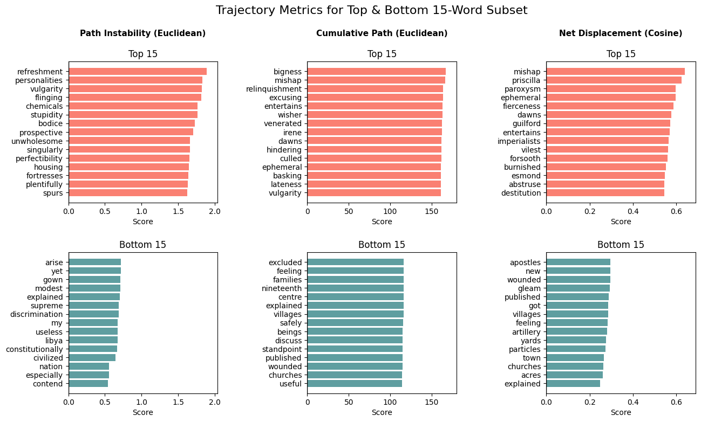
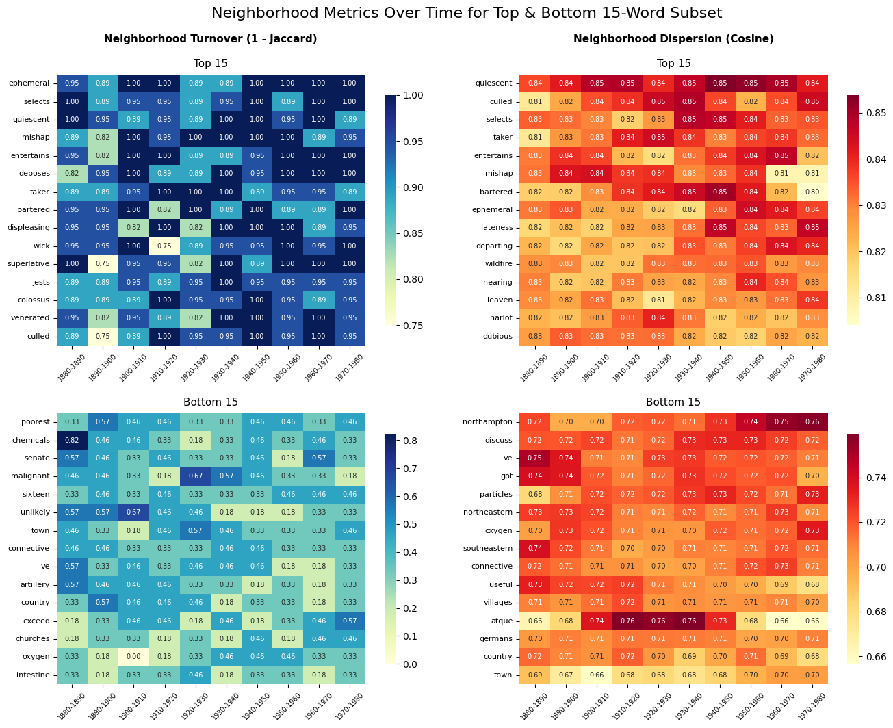
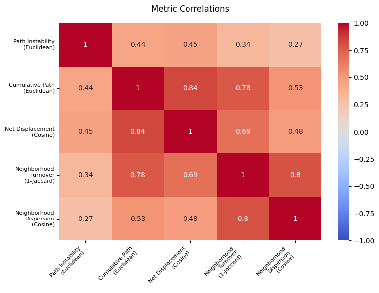
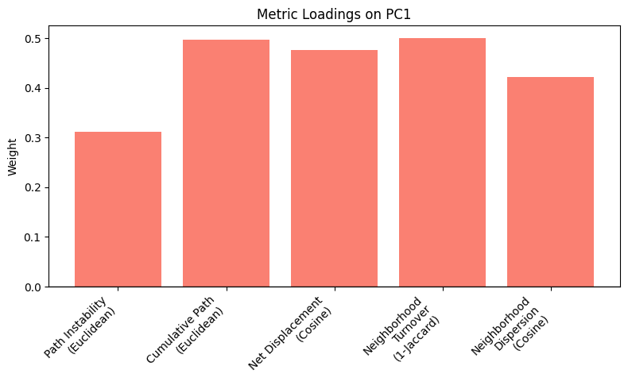
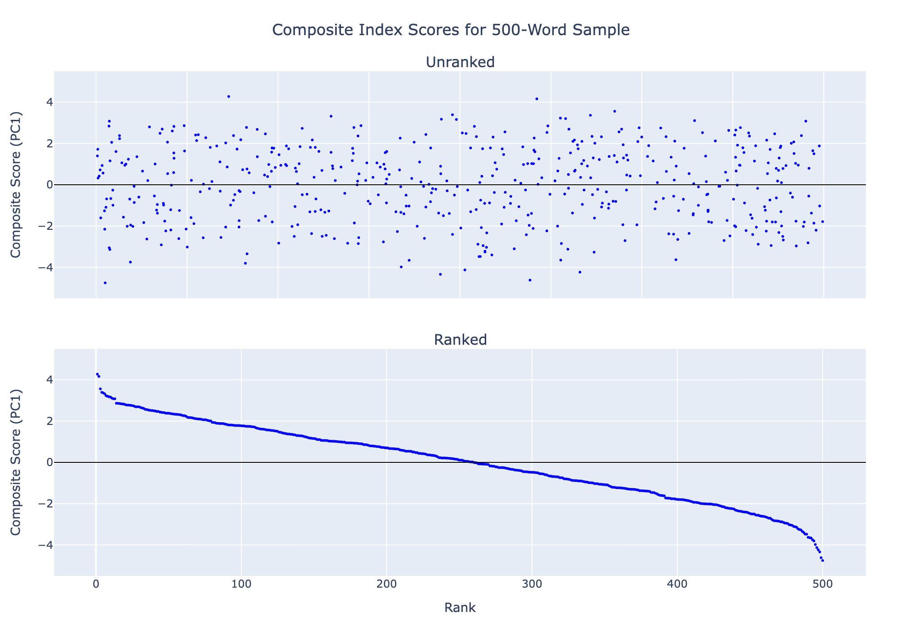
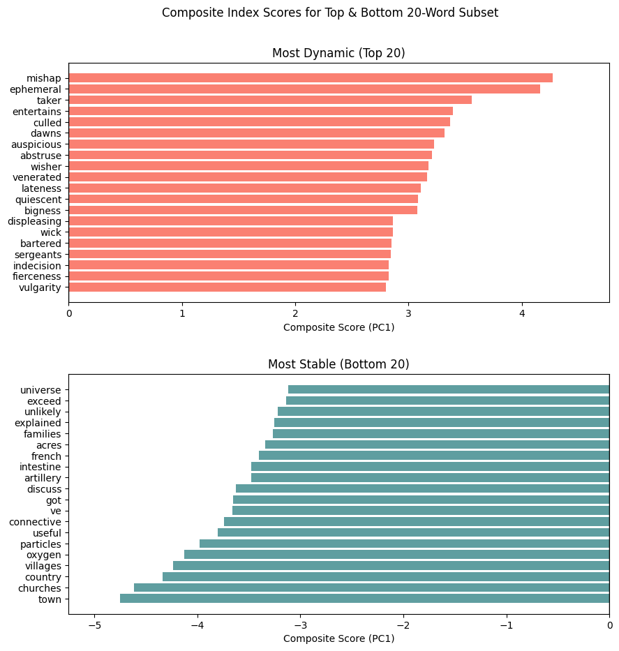
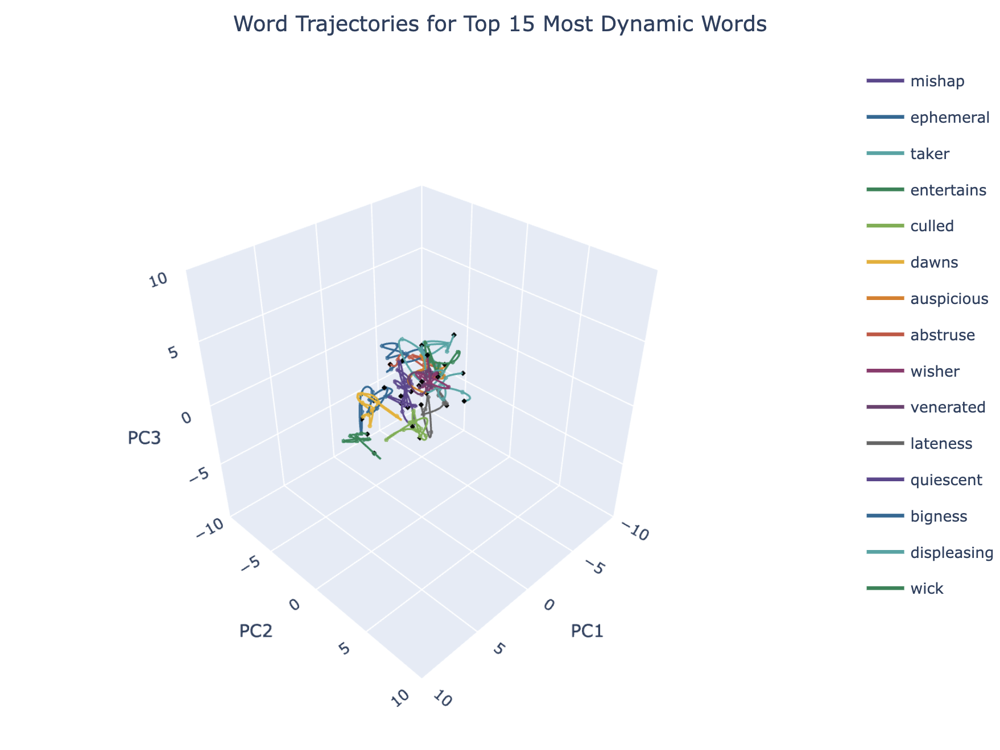
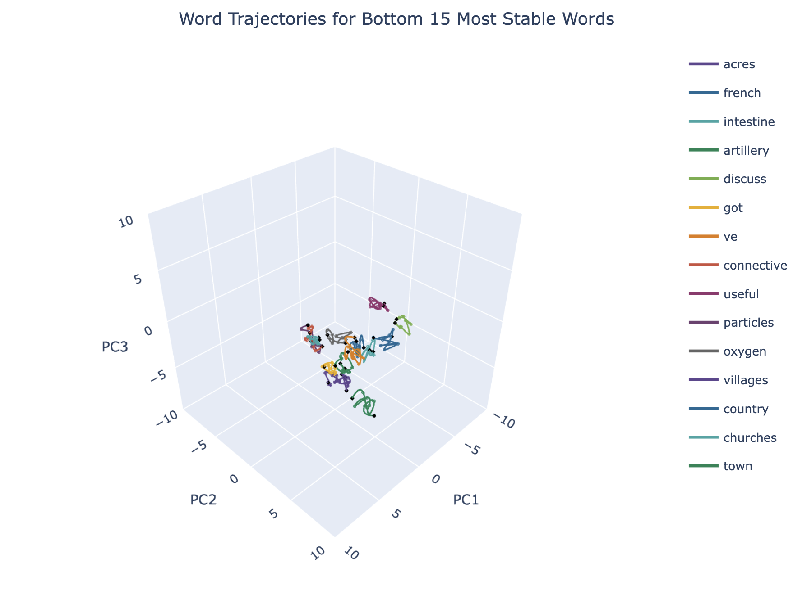
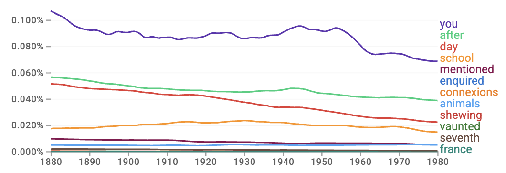

<!-- Narrative for the portfolio hub article (bundled with `@portfolio/article-shell`). -->
<!-- Rule of thumb: "Does this explain the engineering journey for a visitor who has not read the repo?" -->

<!--
Editorial conventions (generic — adapt per project)

Document shape
  • Hub: orients scope, how pieces connect, and what is claimed vs deferred. One readable pass at "what this is" and "what runs".
  • Spokes: mechanism, trade-offs, implementation detail. Short setup + scannable structure (short paragraphs, lists).

Voice
  • Match maintainer voice consistently (e.g. first person in discussing codebase-specific details; inclusive second person "we" only if intentional for a walkthrough).

Formatting
  • `##` / `###` / `####` headings: title case for principal words; keep acronym styling consistent (GPU, API, etc.).
  • Indent nested lists and raw HTML with four spaces per level in source.
  • Fenced code: opening/closing ``` flush left; inner indentation is whatever the snippet needs.
  • Backticks for literals (`TypeName`, file paths). Callable names may use empty parentheses in prose if that is your house style (`train()`, `load()`).
  • Use straight ASCII " and ' in Markdown source; `@portfolio/article-shell` rewrites typographic quotes in prose only (not in code fences, KaTeX, or HTML attributes).
  • Bold sparingly; in definition-style lists, bold the label before the colon.
  • Dashes: en dash (–) for spans only (year ranges, figure ranges, numeric spans). Hyphen (-) for compound words and joined terms (label-value, Rayleigh-Ritz, video-transcript). Em dash (—) for section titles (Part 1 — …), parenthetical breaks in prose, and cross-reference labels.

Accordion / slugs
  • `accordionState` keys MUST match `github-slugger` output for each panel title (same algorithm as `HubArticleDocument` + `rehype-slug`). Em dash in a title becomes `--` in the slug (e.g. `Part 1 — Topic` → `part-1--topic`).
  • The first `##` block after the Series nav divider is lifted into the preface accordion; the second `##` begins the main accordion stream (see `buildArticleMarkdown` / `extractFirstH2PrefaceSection`).

Series navigation
  • Require a line exactly `## Series navigation` (case-insensitive on those words) and a closing thematic break `---` on its own line after the TOC block (`extractSeriesNavigationSection`).
-->

<a id="top"></a>

# Visualizing Semantic Shifts in Word Embeddings Using PCA

*Building the math to track how the meanings of words drift over time*

---

## Series Navigation

- [Hub](#main-high-level-hub-article)
    - [Context](#context)
    - [Approach](#approach)
    - [Conclusions](#conclusions)
- [Spokes](#secondary-low-level-spoke-articles)
    - [Part 1 — Data Handling](#part-1--data-handling)
    - [Part 2 — Dimensionality Reduction](#part-2--dimensionality-reduction)
    - [Part 3 — Analysis](#part-3--analysis)

---

<a id="main-high-level-hub-article"></a>

## Context

Language can change drastically over time. Words that once meant one thing could quietly pick up another meaning, or fade out of common use entirely. "Cloud" and "tweet" are easy modern examples, but the phenomenon goes back as far as language itself. This project is my attempt at making that drift visible by turning a century of English text into something we can actually look at and interpret.

To do that, there first needs to be a way to represent words mathematically. Luckily, modern NLP models already can learn to do this by training on large text corpora. They achieve this by observing which words tend to appear near which other words across millions of sentences, then picking up on patterns and encoding each word as a point in a high-dimensional space. The outcome from this? Words that appear in similar contexts end up closer together, while words that don't, end up farther apart. The resulting numerical representation of a word is called an *embedding*.

The awkward part with such high dimensional spaces is that they're impossible to directly visualize, unless we can condense that space down to a lower-dimensional view in some manner. The good news is that there are already foundational techniques that do this, one of which (involved here) is known as *Principal Component Analysis* (PCA), applied to pre-trained historical word embeddings from an 1880–1980 slice of the [Stanford NLP HistWords](https://nlp.stanford.edu/projects/histwords/) All English dataset. Each decade has its own set of word embeddings, with 100,000 words per decade, and each word represented as a 300-dimensional vector (trained on the text of that era). My goal was to project these 300-dimensional word vectors down into something plottable, while keeping the coordinate system shared across all decades so that the motion of a word through semantic space is actually consistent over time.

---

## Approach

The goal: take a century of higher-dimensional English word vectors, compress them into the more human-interpretable 3D space, and use that compression to visualize how words move semantically over time.

Here's a rundown of my pipeline steps:

**1. Preprocessing (Filtering)**

Starting off, we need to bring the data into agreement across our selected decades. That means filtering out numerical entries (because somehow, the HistWords dataset treats strings like "123" as distinct words), keeping only words that are present in all decades (because words may appear in some decades but not in others), and removing potential zero vectors. Since the All English dataset gives around 100k words per decade, running the full vocab further down the pipeline would be heavy, so during the basic data hygiene filters I build up a subset of valid sampled words.

**2. Standardization (Z-Scores)**

With a shared vocabulary in place, our next thing to handle is fixing offset/spread mismatch within each decade's embeddings. We do this by centering each decade's embeddings to near zero mean and scaling to unit variance. This step is what makes embeddings from different decades numerically comparable before they're all pooled together, as without it, one decade's coordinate scale could dominate the others after pooling.

**3. Alignment (Procrustes)**

Because each decade's embeddings are trained independently, their coordinate systems don't naturally match each other. This could mean that the same cloud of meanings can be oriented in arbitrary ways and that one direction in 1880's space doesn't necessarily mean the same thing in 1940's space. So to fix this before pooling, we must align them somehow. This is where a method called *orthogonal Procrustes alignment* can be applied, which works by finding a rotation for each decade that brings it as close as possible to a chosen anchor decade. In general, orthogonal refers to directions that are perpendicular to each other. Here, orthogonal refers to the transform as a rigid reorientation (rotation or reflection) of the entire cloud of word embeddings together uniformly, where their internal relations are preserved. This is another step in helping with separating signal from noise for each of our trajectories.

**4. Reduction (PCA)**

After our filtering step plus the translational, scale, and rotational alignment steps, we can then pool the embeddings into one unified dataset with a shared *basis* (or a common reference coordinate system). From here, we can finally apply our dimensionality reduction step using PCA. PCA is a technique that finds the top directions in which the higher-dimensional data varies the most, and then projects everything onto those few top directions (usually two or three, for 2D/3D visualization). In our case after PCA, each word per decade in 300D space ends up as a point in a reduced 3D space. Because the same PCA basis is applied to all decades, a word's position in 1880 and its position in 1980 are directly comparable.

**5. Evaluation**

Now, to figure out which words moved the most across our chosen decades from a quantitative approach, we'll be needing various metrics that can serve as lenses for capturing the words' behaviors over time. Using the aligned trajectories (in full embedding space, not the PCA-reduced space, so we're not losing the original geometric information), I designated five per-word metrics to do the quantitative work on our sampled set of words.

- **Path Instability (Euclidean):** How erratic a word's decade-to-decade movement is. Measured as the variability in step sizes across decades.
- **Cumulative Path (Euclidean):** Sum of those same step lengths. Measured as the total distance traveled through the aligned embedding space across all decades.
- **Net Displacement (Cosine):** How much a word's embedding angle changed from its starting decade position to its ending decade position. Measured by cosine distance.
- **Neighborhood Turnover (1 - Jaccard):** For each decade, how much the set of nearest neighbor words changes across consecutive decade-pairs. Sets obtained with k-nearest neighbors (k-NN) and cosine distance and set change measured using Jaccard similarity.
- **Neighborhood Dispersion (Cosine):** How far a word sits from that same neighbor set on average, and how that distance shifts across consecutive decades. Measured by mean cosine distance from each word in the set.

With this group of metrics in place, the next question is naturally: which words moved the most overall? For this, we'll need a way to interpret these metrics in a holistic manner. Rather than manually eyeballing which words to choose from or assigning arbitrary weights to combine these metrics, we can instead just rely on PCA again. Except this time, rather than pooling each *embedding* by decade, we can pool each *metric* by word and then grab the PCA output's first most variable direction on that pool. With this, we can yield one *composite semantic dynamics index* for ranking our words.

**6. Visualization**

Ultimately, the original thing this entire pipeline revolved around is to make the semantic drift of our sampled words visible. Taking our 3D-projected embeddings from Step 4, we can now trace how each word moves through the shared coordinate basis over our eleven-decade timespan. Now, although drawing continuous lines between discrete decades might seem slightly unorthodox from strict data science principles, I made the decision to interpolate the points across decades to produce smoother trajectories for interpretability.

For the final visualization outputs, I created an interactive 3D point-cloud plot with a slider to allow for scrubbing through the timeline to watch the global semantic space evolve in the reduced 3D space. Alongside this, I also created isolated 3D trajectory plots for the top (most dynamic) and bottom (most stable) words, as ranked by our composite index from Step 5. Since this composite index operated directly on the full 300-dimensional space, the trajectory ranks are chosen from a non-PCA-compressed source, which provides a more accurate qualitative sanity check. If our metrics successfully captured true semantic shifts, then the visual trajectories of our top movers should noticeably validate such volatility.

## Conclusions

My pipeline turned a century of high-dimensional word geometry into something rankable and, at least for the most part, interpretable. The clearest result was a linguistic divide that aligned with intuition. Namely, the terms associated with low semantic dynamism appeared to be foundational anchors such as days, numbers, anatomical terms, or institutional structures, while those associated with high semantic dynamism appeared to skew more towards the esoteric, stylistic, or rhetorical "peripherals" of the English language. Now how much of that reflects genuine semantic evolution versus just the artifacts of the pipeline and corpus is a harder question, and one which I address in more detail about in [Limitations and Future Work](#limitations-and-future-work) at the end of [Part 3 — Analysis](#part-3--analysis). The spoke sections below walk through the full six steps of my pipeline in detail, organized into three parts.

---

<a id="secondary-low-level-spoke-articles"></a>

## Part 1 — Data Handling

### Dataset

As mentioned in the introduction, the dataset here is the [Stanford NLP HistWords](https://nlp.stanford.edu/projects/histwords/) All English dataset. Each decade ships as two files: a pickled vocabulary list (`{decade}-vocab.pkl`) and a NumPy array of 300-dimensional vectors (`{decade}-w.npy`). These embeddings were pretrained using *skip-gram with negative sampling* (SGNS), which is a method for learning word representations by training a model to predict what words tend to appear near which other words across a large text corpus. In this case, the result is a 300-dimensional vector for each word that encodes co-occurrence patterns from a specific decade's text.

For this project, I work with the 1880–1980 slice as eleven decades with 100,000 words each. This totals up to 1.1 million 300-dimensional vectors before any filtering, which is why I make the choice to subsample down to a working vocabulary set of 500 words for my pipeline.

To express the structure of this dataset more concretely, given my decade set $T = \{1880,1890,\ldots,1980\}$, for each decade $t \in T$, HistWords gives an ordered vocabulary list $\mathcal{V}^{(t)}$ and a matching embedding matrix $\mathbf{W}^{(t)}$:

$$
\mathcal{V}^{(t)} = \bigl(\texttt{word}_{1}^{(t)},\,\texttt{word}_{2}^{(t)},\,\cdots,\,\texttt{word}_{N}^{(t)}\bigr),
$$

$$
\mathbf{W}^{(t)}
=
\begin{bmatrix}
w_{1,1}^{(t)} & w_{1,2}^{(t)} & \cdots & w_{1,300}^{(t)} \\
w_{2,1}^{(t)} & w_{2,2}^{(t)} & \cdots & w_{2,300}^{(t)} \\
\vdots & \vdots & \ddots & \vdots \\
w_{N,1}^{(t)} & w_{N,2}^{(t)} & \cdots & w_{N,300}^{(t)}
\end{bmatrix}
=
\begin{bmatrix}
-\; \mathbf{w}_1^{(t)} \;- \\
-\; \mathbf{w}_2^{(t)} \;- \\
\vdots \\
-\; \mathbf{w}_N^{(t)} \;-
\end{bmatrix},
$$

where $\mathbf{W}^{(t)} \in \mathbb{R}^{N \times d}$, $N ≈ 10^5$, and $d = 300$.

Here, $\texttt{word}_{i}^{(t)}$ and $\mathbf{w}_{i}^{(t)}$ are the $i$-th word entry and its corresponding embedding vector as the $i$-th row in $\mathbf{W}^{(t)}$ respectively. Each $w_{ij}^{(t)}$ in that row denotes the $j$-th scalar coordinate of that embedding in $\mathbb{R}^{300}$ (300-dimensional space).

---

### Preprocessing

Because each decade was trained on a different time slice of a bigger corpus collection, the full set of 100,000 words per decade will naturally be messy. In order to handle this, my preprocessing applies three stages of filtering to obtain a resulting clean subsample from the total word set:

- **Numerical Filtering:** Each decade's vocabulary is scanned for strings containing any digit character, which are dropped. Years, counts, or ID-like strings don't carry the kind of semantic drift info for my pipeline that's meaningful.
- **Vocabulary Intersection:** The shared vocabulary should be the set of words present in *all* eleven decades simultaneously. To enforce this, I apply an intersection computed incrementally, starting from the 1880 vocabulary and updating against each subsequent decade. The leftovers become part of the pool of words that can actually be tracked across the full 1880–1980 time span.
- **Zero-Vector Skipping:**  As the sample set is formed, each candidate word is checked against all eleven decades. If its embedding is a zero vector in any decade, it's skipped. Although HistWords has no known documentation of having zero vectors, I include this step as an extra precaution.

During zero vector skipping, valid samples are drawn from the intersected vocabulary set with a seeded shuffle until the fixed sample size is met, so the specific words selected are reproducible across runs. For my project I use a sample size of 500. The final result is a set of words with valid, non-degenerate embedding matrices across the full time span, which I will now refer to as $\mathbf{X}^{(t)} \in \mathbb{R}^{n \times d}$, where $n = 500$.

---

### Standardization

My previous step handled *which* words we keep, but from now on in this part of the pipeline, I must handle how those surviving words are numerically distributed in space. With a clean vocabulary in place, the next issue is that each decade's embeddings are independently trained, which means their coordinate scales are entirely arbitrary. What this entails is that a word's vector dimension that spans [-3, 3] in 1880 might span [-0.1, 0.1] in 1940.

Now, if I pooled these embeddings together by decade and applied PCA directly, the decades with the larger magnitudes would look like they have a farther spread than others, and ultimately dominate the shared coordinate space. My standardization step addresses this by centering each decade's embedding matrix to near zero mean and scaling it to unit sample variance for each dimension.

Given a decade's word-sampled embedding matrix $\mathbf{X}^{(t)}$ and its scalar coordinate entries $x_{ij}^{(t)}$, we first find the center of the data by calculating the mean ($\mu$) for a given dimension $j$ across all $n$ words:

$$
\mu_j^{(t)} = \frac{1}{n} \sum_{i=1}^{n} x_{ij}^{(t)}.
$$

Next, we measure how spread out the data is around that center using the sample standard deviation ($\sigma$):

$$
\sigma_j^{(t)} = \sqrt{\frac{1}{n-1} \sum_{i=1}^{n} \left(x_{ij}^{(t)} - \mu_j^{(t)}\right)^2}.
$$

Finally, we apply these statistics to compute the standardized matrix $\mathbf{Z}^{(t)}$ by calculating the element-wise z-score for every individual coordinate. This involves subtracting the mean and dividing by the standard deviation (denominator set to one when standard deviation equals zero):

$$
\tilde{\sigma}_j^{(t)} =
\begin{cases}
\sigma_j^{(t)}, & \sigma_j^{(t)} > 0, \\
1, & \sigma_j^{(t)} = 0,
\end{cases}
\qquad
z_{ij}^{(t)} = \frac{x_{ij}^{(t)} - \mu_j^{(t)}}{\tilde{\sigma}_j^{(t)}}.
$$

With this, we now have eleven independently standardized matrices $\mathbf{Z}^{(1880)}, \ldots, \mathbf{Z}^{(1980)}$ across each decade. A quick sanity check on my pipeline output: for each decade, column means should land at zero and column standard deviations at one. Here are some sample decade before-and-after outputs for their first five embedding dimensions:

```
1880's embedding means/stds before vs. after standardization (first 5 dims):
  Before:  [ 0.02   0.03   0.00  -0.01  -0.01] / [0.07  0.08  0.06  0.05  0.06]
  After:   [~0.00  ~0.00  ~0.00  ~0.00  ~0.00] / [1.00  1.00  1.00  1.00  1.00]

1890's embedding means/stds before vs. after standardization (first 5 dims):
  Before:  [ 0.01   0.02   0.01  -0.01  -0.01] / [0.07  0.07  0.06  0.05  0.06]
  After:   [~0.00  ~0.00  ~0.00  ~0.00  ~0.00] / [1.00  1.00  1.00  1.00  1.00]

(Pattern holds for rest of the 10 decades. Means collapse to machine-precision zero,
standard deviations to 1.00.)
```

---

### Alignment (Procrustes)

After my standardization step, offsets and spread are now lined up across decades, but the last problem remains in the form of axis orientation mismatch between decades. As mentioned before, each decade's SGNS model is initialized randomly and trained on a different corpus, so as a result, the resulting coordinate systems can differ by arbitrary rotations or reflections. This means that the direction encoded in a word's vector might point northeast in 1880's space, whereas it might point southwest in 1940's space.

To solve this, I apply a method called *orthogonal Procrustes alignment*, which removes that mismatch by finding the optimal rigid alignment map (rotation or reflection) that brings each decade's embedding space as close as possible to a common reference space, or *anchor*, without distorting their internal relative geometric relationships.

#### Procrustes Residuals and Anchor Selection

Before aligning, my pipeline needs to select which decade to best use as the reference anchor. The criterion for "best" that I use here is simply just to select the decade that is the least misaligned from all other decades. Mathematically, this anchor is the geometric *medoid* of the rest of the decades and serves to minimize the sum of total pairwise misalignment with all other decades. I'll call that minimum misfit the Procrustes residual.

To find this medoid, we first need a way to quantify the misfit between any two decades' embeddings. Given two standardized matrices $\mathbf{Z}^{(a)}, \mathbf{Z}^{(b)} \in \mathbb{R}^{n \times d}$ (with distinct decades $a, b \in T$, $a \neq b$, and $d = 300$ embedding dimensions, sharing the same 500 words), the misfit — as the *Procrustes residual* $r$ — between them is the smallest squared Frobenius distance achievable by rotating one onto the other (through some optimal rotation matrix $\boldsymbol{\Omega}$):

$$
r\left(\mathbf{Z}^{(a)}, \mathbf{Z}^{(b)}\right)
=
\min_{\boldsymbol{\Omega}^\top\boldsymbol{\Omega}=\mathbf{I}}\
\bigl\| \mathbf{Z}^{(a)} \boldsymbol{\Omega} - \mathbf{Z}^{(b)} \bigr\|_F^2.
$$

When we expand this expression, it reveals that the residual depends on a tug-of-war between a part that is fixed regardless of what rotation we choose, and a part that changes with $\boldsymbol{\Omega}$:

$$
\underbrace{\bigl\| \mathbf{Z}^{(a)} \boldsymbol{\Omega} - \mathbf{Z}^{(b)} \bigr\|_F^2}_{\text{Alignment error}}
=
\underbrace{\bigl\| \mathbf{Z}^{(a)} \bigr\|_F^2 + \bigl\| \mathbf{Z}^{(b)} \bigr\|_F^2}_{\text{Total variance (fixed)}}
-
\underbrace{2 \operatorname{tr}\!\left( \boldsymbol{\Omega}^\top \mathbf{M}^{(a,b)} \right)}_{\text{Alignment (varying)}}
$$

Since the first term is a constant, the useful algebraic fact is that minimizing that error is the same problem as making the alignment term as large as possible:

$$
\operatorname*{arg\,min}_{\boldsymbol{\Omega}^\top\boldsymbol{\Omega}=\mathbf{I}}\
\underbrace{\bigl\| \mathbf{Z}^{(a)} \boldsymbol{\Omega} - \mathbf{Z}^{(b)} \bigr\|_F^2}_{\text{Alignment error}}
=
\operatorname*{arg\,max}_{\boldsymbol{\Omega}^\top\boldsymbol{\Omega}=\mathbf{I}}\
\underbrace{\operatorname{tr}\!\left( \boldsymbol{\Omega}^\top \mathbf{M}^{(a,b)} \right)}_{\text{Alignment (varying)}}.
$$

Now, at the heart of that alignment term lies the *cross-similarity matrix* $\mathbf{M}^{(a,b)} \in \mathbb{R}^{d \times d}$, whose $(j, k)$ entry is the inner product between the $j$-th dimension of decade $a$'s embedding cloud and the $k$-th dimension of decade $b$'s:

$$
\begin{aligned}
\mathbf{M}^{(a,b)}
&=
\mathbf{Z}^{(a)\top}\mathbf{Z}^{(b)} \\
&=
\begin{bmatrix}
-\; \mathbf{z}^{(a)\top}_{\cdot 1} \;- \\
-\; \mathbf{z}^{(a)\top}_{\cdot 2} \;- \\
\vdots \\
-\; \mathbf{z}^{(a)\top}_{\cdot d} \;-
\end{bmatrix}
\begin{bmatrix}
| & | & & | \\
\mathbf{z}^{(b)}_{\cdot 1} &
\mathbf{z}^{(b)}_{\cdot 2} &
\cdots &
\mathbf{z}^{(b)}_{\cdot d} \\
| & | & & |
\end{bmatrix} \\
&=
\begin{bmatrix}
\langle \mathbf{z}^{(a)}_{\cdot 1}, \mathbf{z}^{(b)}_{\cdot 1} \rangle &
\langle \mathbf{z}^{(a)}_{\cdot 1}, \mathbf{z}^{(b)}_{\cdot 2} \rangle &
\cdots &
\langle \mathbf{z}^{(a)}_{\cdot 1}, \mathbf{z}^{(b)}_{\cdot d} \rangle \\
\langle \mathbf{z}^{(a)}_{\cdot 2}, \mathbf{z}^{(b)}_{\cdot 1} \rangle &
\langle \mathbf{z}^{(a)}_{\cdot 2}, \mathbf{z}^{(b)}_{\cdot 2} \rangle &
\cdots &
\langle \mathbf{z}^{(a)}_{\cdot 2}, \mathbf{z}^{(b)}_{\cdot d} \rangle \\
\vdots & \vdots & \ddots & \vdots \\
\langle \mathbf{z}^{(a)}_{\cdot d}, \mathbf{z}^{(b)}_{\cdot 1} \rangle &
\langle \mathbf{z}^{(a)}_{\cdot d}, \mathbf{z}^{(b)}_{\cdot 2} \rangle &
\cdots &
\langle \mathbf{z}^{(a)}_{\cdot d}, \mathbf{z}^{(b)}_{\cdot d} \rangle
\end{bmatrix}
\in \mathbb{R}^{d \times d}.
\end{aligned}
$$

Here, think of this cross-similarity matrix's role as a $d \times d$ scoreboard where a row/column position $(j, k)$ tells us how consistently embedding dimension $j$ in decade $a$ points in the same direction as dimension $k$ in decade $b$ across all of our 500 words. Large positive entries mean those dimension pairs agree strongly, whereas entries near zero mean they are uncorrelated.

The computational dilemma at this point is that, in order to find our anchor, my pipeline would have to evaluate the aforementioned Procrustes residual for every possible pair of decades, requiring $\binom{|T|}{2}$ evaluations in total. Naively, for $|T| = 11$, this means we would have to compute the optimal rotation $\boldsymbol{\Omega}$ for every pair, apply it, measure the distance 55 times. For 54 of those times, we are wastefully throwing that rotation away. However, looking closely at the expanded residual expression exposes a shortcut where we never actually need $\boldsymbol{\Omega}$ just to evaluate the misfit. The shortcut is that the maximum alignment has a closed-form solution which depends solely on the cross-similarity matrix $\mathbf{M}^{(a,b)}$, rather than on the rotation itself.

But for the sake of establishing a baseline understanding, let's return to that alignment term $\operatorname{tr}(\boldsymbol{\Omega}^\top\mathbf{M}^{(a,b)})$ from earlier. The task of maximizing it using some rotation map $\boldsymbol{\Omega}$ really involves asking: which rotation extracts the most total agreement from our cross-similarity matrix $\mathbf{M}^{(a,b)}$? To find such a rotation, we can factorize our cross-similarity matrix into its fundamental rotational ($\mathbf{U}$ and $\mathbf{V}$) and scaling matrix components using a method called *singular value decomposition* (SVD):

$$
\mathbf{M}^{(a,b)} = \mathbf{U}\,\boldsymbol{\Sigma}\,\mathbf{V}^{\top} \in \mathbb{R}^{d\times d},
$$

$$
\mathbf{U} =
\begin{bmatrix}
| & | & & | \\
\mathbf{u}_{\cdot 1} & \mathbf{u}_{\cdot 2} & \cdots & \mathbf{u}_{\cdot d} \\
| & | & & |
\end{bmatrix},
\qquad
\mathbf{V}^{\top} =
\begin{bmatrix}
-\; \mathbf{v}_{\cdot 1}^{\top} \;- \\
-\; \mathbf{v}_{\cdot 2}^{\top} \;- \\
\vdots \\
-\; \mathbf{v}_{\cdot d}^{\top} \;-
\end{bmatrix},
\\[0.6em]
\boldsymbol{\Sigma} =
\begin{bmatrix}
\sigma_{1} & 0 & \cdots & 0 \\
0 & \sigma_{2} & \cdots & 0 \\
\vdots & \vdots & \ddots & \vdots \\
0 & 0 & \cdots & \sigma_{d}
\end{bmatrix}.
$$

What this SVD step does for us is that it isolates the **dominant paired orthogonal directions** of our two embedding spaces and **how much they agree**. The left singular column vectors of $\mathbf{U}$ define the orthogonal directions associated with decade $a$'s embedding space, while right singular row vectors of $\mathbf{V}^{\top}$ define their matched directions associated with decade $b$'s space. The diagonal matrix $\mathbf{\Sigma}$ contains what are called the *singular values* $\sigma_i$ (not to be confused with our sample standard deviation from our standardization step).

These singular values are special since they measure how strongly the agreements along each of those paired directions are. A large $\sigma_i$ means the $i$-th directional pair between decade $a$ and $b$ is strongly correlated across all $n$ words, and vice versa for smaller $\sigma_i$.

Under the SVD of $\mathbf{M}^{(a,b)}$, it turns out that the best total directional agreement from our cross-similarity matrix comes from the sum of these singular values or the sum of the diagonals of $\boldsymbol{\Sigma}$ (called the *trace*):

$$
\max_{\boldsymbol{\Omega}^\top \boldsymbol{\Omega} = \mathbf{I}}
\operatorname{tr}\!\left(
\boldsymbol{\Omega}^\top \mathbf{M}^{(a,b)}
\right)
=
\operatorname{tr}(\boldsymbol{\Sigma})
=
\sum_{i=1}^{d} \sigma_i.
$$

And this is exactly where that aforementioned shortcut resides. To evaluate the residual, we actually don't need to construct the optimal rotation $\boldsymbol{\Omega}^* = \mathbf{U}\mathbf{V}^\top$ and apply it each of those 54 times. We only need the $\sigma_i$ values.

Now to see why, notice what the trace expression from our alignment term,

$$
\operatorname{tr}\left(\boldsymbol{\Omega}^\top\mathbf{M}^{(a,b)}\right),
$$

is actually summing. The $(i,i)$ diagonal entry of $\boldsymbol{\Omega}^\top\mathbf{M}^{(a,b)}$ is the dot product of the $i$-th row of $\boldsymbol{\Omega}^{\top}$ with the $i$-th column of $\mathbf{M}^{(a,b)}$.

Intuitively, the result of this dot product describes the agreement of direction $i$ of an aligned embedding space with its matching direction of another embedding after rotation. By contrast, the off-diagonal entries measure cross-directional interaction, which is: how much one rotated direction $i$ still "leaks" into the other unmatched directions $j \neq i$ of the scoreboard.

Since the trace operator sums only the diagonal entries of a matrix, the alignment score counts only how strongly each rotated direction agrees with its matched counterpart. Maximizing the trace therefore means finding the rotation that concentrates as much agreement as possible onto these matched directional pairs.

Conveniently, the SVD has already identified those optimal paired directions for us. Substituting the optimal rotation

$$
\boldsymbol{\Omega}^{*} = \mathbf{U} \mathbf{V}^{\top}
$$

into our alignment term and applying the cyclic property of the trace,

$$
\operatorname{tr}(\mathbf{ABCD})
=
\operatorname{tr}(\mathbf{DABC})
=
\operatorname{tr}(\mathbf{CDAB})
=
\operatorname{tr}(\mathbf{BCDA}),
$$

offers us a wonderfully convenient simplification:

$$
\begin{aligned}
\max_{\boldsymbol{\Omega}^\top \boldsymbol{\Omega} = \mathbf{I}}
\operatorname{tr}\!\left(
\boldsymbol{\Omega}^\top \mathbf{M}^{(a,b)}
\right)
&=
\operatorname{tr}\left(\boldsymbol{\Omega}^{*\top} \mathbf{M}^{(a,b)}\right) \\
&=
\operatorname{tr}\left((\mathbf{U}\mathbf{V}^{\top})^{\top}\mathbf{U}\boldsymbol{\Sigma}\mathbf{V}^{\top}\right) \\
&=
\operatorname{tr}\left(\mathbf{V}\mathbf{U}^{\top}\mathbf{U}\boldsymbol{\Sigma}\mathbf{V}^{\top}\right) \\
&=
\operatorname{tr}\left(\mathbf{V}\boldsymbol{\Sigma}\mathbf{V}^{\top}\right) \\
&=
\operatorname{tr}\left(\mathbf{V}^{\top}\mathbf{V}\boldsymbol{\Sigma}\right) \\
&=
\operatorname{tr}\left(\boldsymbol{\Sigma}\right)
=
\sum_{i=1}^{d} \sigma_i.
\end{aligned}
$$

And thus, $\sum_i\sigma_i$ represents the absolute geometric ceiling on how much alignment we can extract. Substituting this back into our original expansion, the minimum possible Procrustes residual between any two decades simplifies to:

$$
r(\mathbf{Z}^{(a)},\,\mathbf{Z}^{(b)})
=
\bigl\|\mathbf{Z}^{(a)}\bigr\|_F^2 + \bigl\|\mathbf{Z}^{(b)}\bigr\|_F^2 - 2\sum_{i=1}^{d}\sigma_i\!\bigl(\mathbf{M}^{(a,b)}\bigr).
$$

#### Applying the Rotations

Wrapping all of that together in the context of my pipeline, this shortcut allows me to split this alignment step into two phases:

**Phase 1: Anchor selection using Procrustes residuals.** Because our residual formula only needs the singular values $\sigma_i$, we can just run a cheaper non-$\mathbf{UV}$ SVD for each of the $\binom{|T|}{2}$ pairs, extracting only the $\boldsymbol{\Sigma}$ diagonal and effectively skipping the construction of $\mathbf{U}$ and $\mathbf{V}$ entirely. The squared Frobenius norms $\|\mathbf{Z}^{(t)}\|_F^2$ are also cached once per decade for reusability across all pairs. The anchor decade $t^*$ is then the one that minimizes the total misfit against all other decades:

$$
t^* = \operatorname*{arg\,min}_{a \in T}\;\sum_{b \in T,\,b \neq a}
r\!\left(\mathbf{Z}^{(a)},\,\mathbf{Z}^{(b)}\right).
$$

**Phase 2: Computing and applying the rotation.** With the anchor chosen, the full SVD is run once per non-anchor decade against $\mathbf{Z}^{(t^*)}$ to obtain their individual optimal rotation matrices $\boldsymbol{\Omega}^{*(t)} = \mathbf{U}\mathbf{V}^\top$ (for each decade $t \neq t^*$), which are then applied to each decade's standardized embedding space $\mathbf{Z}^{(t)}$ to produce their aligned matrices:

$$
\mathbf{A}^{(t)} = \mathbf{Z}^{(t)}\boldsymbol{\Omega}^{*(t)}.
$$

Each non-anchor decade is aligned directly to the anchor in one step rather than chaining rotations one anchor after the next sequentially across the decades, as this risks letting alignment errors compound across each decade. The outputs from a quick sanity check help me confirm the alignment worked: $\|\mathbf{A}^{(t)} - \mathbf{Z}^{(t^*)}\|_F^2$ should be strictly smaller than the pre-alignment distance for every rotated decade.

```
Anchor decade: 1930

1880 vs 1930 alignment errors:
  Before: 173196.8792
  After:  81588.5401

1890 vs 1930 alignment errors:
  Before: 170806.8333
  After:  80567.7496

1900 vs 1930 alignment errors:
  Before: 163476.1823
  After:  78023.5551

1910 vs 1930 alignment errors:
  Before: 155779.0166
  After:  76184.3446

1920 vs 1930 alignment errors:
  Before: 144359.8334
  After:  74791.1479

1940 vs 1930 alignment errors:
  Before: 144596.1416
  After:  74961.5850

1950 vs 1930 alignment errors:
  Before: 157180.8570
  After:  76400.0783

1960 vs 1930 alignment errors:
  Before: 165616.0885
  After:  78508.4481

1970 vs 1930 alignment errors:
  Before: 176172.9724
  After:  82026.5535

1980 vs 1930 alignment errors:
  Before: 183578.2133
  After:  85012.9197

Decades improved (lower error after): 10/10
Average pre-alignment squared error:  163476.3018
Average post-alignment squared error: 78806.4922
```

---

## Part 2 — Dimensionality Reduction

Working in 300 dimensions is mathematically rich, but it's also geometrically opaque to humans. Our word embeddings hold vast and dense spatial information across their 300 directions that isn't directly interpretable. So our goal at this step is to find a smaller number of directions that preserve as much of that structure as possible, then re-express every word vector using only those directions. That compression is what PCA does.

Under the context of PCA, it can help to picture each decade's 300-dimensional cloud of word vectors as an elongated blob that's spread farther in some directions than others. PCA's job is to compress that higher-dimensional blob down to a targeted lower-dimensional space while retaining as much of its original representative spread as possible. Intuitively, PCA works by finding the axis along which that blob is most elongated and calls it the first *principal component* (PC1). Then it finds the next-most-elongated direction that is perpendicular to PC1 (PC2). And so on. Each principal component is ranked by how much of the original spread it captures. Projecting that data onto the top $k$ of these axes (three in our case, for 3D visualization) discards the remaining, less informative directions while keeping as much of the original spread intact as possible.

It's worth keeping in mind that a critical decision I make here is to derive one shared PCA coordinate basis from all eleven decades into a combined space, rather than applying PCA separately to each decade. If we ran PCA per-decade, then each decade would get its own independent set of principal axes, and a word's 3D position in 1880 would live in a completely different coordinate system from its position in 1980, rendering our later goal of visual trajectory plots across time geometrically meaningless.

---

### Pooling and the Covariance Matrix

After alignment, I stack all eleven per-decade matrices $\mathbf{A}^{(1880)}, \ldots, \mathbf{A}^{(1980)} \in \mathbb{R}^{n \times d}$ into one large, monolithic pooled matrix (row-wise concatenation):

$$
\tilde{\mathbf{A}}
=
\begin{bmatrix}
\mathbf{A}^{(1880)} \\
\vdots \\[0.5em]
\mathbf{A}^{(1980)}
\end{bmatrix}
=
\begin{bmatrix}
{a}^{(1880)}_{1,1} & \cdots & {a}^{(1880)}_{1,d} \\
\vdots & \ddots & \vdots \\
{a}^{(1880)}_{n,1} & \cdots & {a}^{(1880)}_{n,d} \\
& \vdots & \\[0.75em]
{a}^{(1980)}_{1,1} & \cdots & {a}^{(1980)}_{1,d} \\
\vdots & \ddots & \vdots \\
{a}^{(1980)}_{n,1} & \cdots & {a}^{(1980)}_{n,d}
\end{bmatrix}
\in \mathbb{R}^{N_{\text{pool}} \times d},
$$

where $N_{\text{pool}} = |T| \cdot n = 11 \times 500 = 5500$ is the total number of word rows across all decades. Each row is one word's 300-dimensional aligned vector at one particular decade. Pooling here first sets us up to establish one common PCA basis in our subsequent steps, where every word under every decade can get projected onto the same three axes.

Recall, back in our standardization step, we centered each $\mathbf{Z}^{(t)}$ to zero mean followed by our Procrustes alignment step. Because a rigid orthogonal rotation of a zero-mean matrix is still zero-mean, our newly pooled matrix $\tilde{\mathbf{A}}$ is also column-wise zero-centered.

From this pooled matrix, we can now compute what the data's spread looks like across all 300 dimensions simultaneously. This is described by the *sample covariance matrix* $\mathbf{C} \in \mathbb{R}^{d \times d}$:

$$
\begin{aligned}
\mathbf{C}
&=
\frac{1}{N_{\text{pool}} - 1}\,\tilde{\mathbf{A}}^{\top}\tilde{\mathbf{A}}
\\[0.4em]
&=
\frac{1}{N_{\text{pool}} - 1}
\begin{bmatrix}
-\; \mathbf{a}_{\cdot 1}^{\top} \;- \\
-\; \mathbf{a}_{\cdot 2}^{\top} \;- \\
\vdots \\
-\; \mathbf{a}_{\cdot d}^{\top} \;-
\end{bmatrix}
\begin{bmatrix}
| & | & & | \\
\mathbf{a}_{\cdot 1} & \mathbf{a}_{\cdot 2} & \cdots & \mathbf{a}_{\cdot d} \\
| & | & & |
\end{bmatrix}
\\[0.4em]
&=
\frac{1}{N_{\text{pool}} - 1}
\begin{bmatrix}
\langle \mathbf{a}_{\cdot 1}, \mathbf{a}_{\cdot 1} \rangle &
\langle \mathbf{a}_{\cdot 1}, \mathbf{a}_{\cdot 2} \rangle &
\cdots &
\langle \mathbf{a}_{\cdot 1}, \mathbf{a}_{\cdot d} \rangle \\
\langle \mathbf{a}_{\cdot 2}, \mathbf{a}_{\cdot 1} \rangle &
\langle \mathbf{a}_{\cdot 2}, \mathbf{a}_{\cdot 2} \rangle &
\cdots &
\langle \mathbf{a}_{\cdot 2}, \mathbf{a}_{\cdot d} \rangle \\
\vdots & \vdots & \ddots & \vdots \\
\langle \mathbf{a}_{\cdot d}, \mathbf{a}_{\cdot 1} \rangle &
\langle \mathbf{a}_{\cdot d}, \mathbf{a}_{\cdot 2} \rangle &
\cdots &
\langle \mathbf{a}_{\cdot d}, \mathbf{a}_{\cdot d} \rangle
\end{bmatrix}
\\[0.4em]
&=
\begin{bmatrix}
\mathrm{Var}(\mathbf{a}_{\cdot 1}) &
\mathrm{Cov}(\mathbf{a}_{\cdot 1}, \mathbf{a}_{\cdot 2}) &
\cdots &
\mathrm{Cov}(\mathbf{a}_{\cdot 1}, \mathbf{a}_{\cdot d}) \\
\mathrm{Cov}(\mathbf{a}_{\cdot 2}, \mathbf{a}_{\cdot 1}) &
\mathrm{Var}(\mathbf{a}_{\cdot 2}) &
\cdots &
\mathrm{Cov}(\mathbf{a}_{\cdot 2}, \mathbf{a}_{\cdot d}) \\
\vdots & \vdots & \ddots & \vdots \\
\mathrm{Cov}(\mathbf{a}_{\cdot d}, \mathbf{a}_{\cdot 1}) &
\mathrm{Cov}(\mathbf{a}_{\cdot d}, \mathbf{a}_{\cdot 2}) &
\cdots &
\mathrm{Var}(\mathbf{a}_{\cdot d})
\end{bmatrix}
\in \mathbb{R}^{d \times d},
\end{aligned}
$$

Notice that $\mathbf{C}$ has the same $d \times d$ shape as the cross-similarity matrix $\mathbf{M}^{(a,b)}$ from our alignment step. For the same reasons, both measure how embedding dimensions relate to each other across a set of word vectors. The difference is what those vectors are. $\mathbf{M}^{(a,b)}$ was performing cross-comparison between two *different* decades (asking how strongly dimension $j$ in decade $a$ aligned with dimension $k$ in decade $b$). $\mathbf{C}$ here is performing self-comparison of the pooled matrix *with itself* (asking how strongly dimension $j$ co-varies with dimension $k$ across all $|T| \cdot n$ word rows), normalized by $\frac{1}{|T| \cdot n - 1}$ to turn the inner products into a proper sample covariance.

Intuitively, the entry $\mathbf{C}_{jk}$ tells us how much dimension $j$ and dimension $k$ tend to move together across all 5500 word vectors. When $\mathbf{C}_{jk}$ is large, words with larger values on dimension $j$ tend to also have larger values on $k$. When it is near zero, those two dimensions are uncorrelated. The diagonal entries $\mathbf{C}_{jj}$ are just the variances of each individual dimension.

---

### Eigenvalues and Eigenvectors

We noted earlier that the core objective of PCA is to find the principal components, which were the directions of highest spread across our pooled cloud of embeddings. With our covariance matrix $\mathbf{C}$ encoding this spread for the 5500 pooled word vectors across all 300 dimensions, we need a way to extract the specific directions that carry most of that spread from this matrix.

To do that, it first helps to think of $\mathbf{C}$ as a geometric operator that, when applied to some candidate input vector $\mathbf{u} \in \mathbb{R}^d$, outputs a new vector $\mathbf{C}\mathbf{u} \in \mathbb{R}^d$ (a *linear transformation*). In this case, this input vector is not a word embedding vector itself, but rather a probe axis that we are testing against our embedding cloud. For most vectors, this operation deflects them in a way such that the resulting output vector $\mathbf{w}$ points in a different direction from the input vector $\mathbf{u}$, pulling them toward the high-variance regions of the embeddings:

$$
\mathbf{C}\mathbf{u} = \mathbf{w}.
$$

But there exist special directions — let's call them $\mathbf{v}$ for now — where $\mathbf{C}$ cannot knock the vector off course. When $\mathbf{C}$ acts on one of these special directions, the vector stays pointed the same way and experiences nothing but a simple scaling:

$$
\mathbf{C}\mathbf{v} = \lambda\,\mathbf{v}.
$$

Expanding this equation, we can see that this dynamic behaves in a way such that the matrix-vector product on the left must produce exactly the same column of numbers as the right, only scaled by $\lambda$:

$$
\mathbf{C}\mathbf{v}
=
\begin{bmatrix}
c_{11} & c_{12} & \cdots & c_{1d} \\
c_{21} & c_{22} & \cdots & c_{2d} \\
\vdots & \vdots & \ddots & \vdots \\
c_{d1} & c_{d2} & \cdots & c_{dd}
\end{bmatrix}
\begin{bmatrix}
v_1 \\ v_2 \\ \vdots \\ v_d
\end{bmatrix}
=
\begin{bmatrix}
\sum_{j=1}^{d} c_{1j}\,v_j \\[4pt]
\sum_{j=1}^{d} c_{2j}\,v_j \\
\vdots \\
\sum_{j=1}^{d} c_{dj}\,v_j
\end{bmatrix}
=
\lambda
\begin{bmatrix}
v_1 \\ v_2 \\ \vdots \\ v_d
\end{bmatrix}.
$$

These rotation-immune directions are called *eigenvectors*, and their corresponding scaling factors $\lambda$ are called *eigenvalues*. In this case, they are the eigenpairs specific to $\mathbf{C}$. We'll rename the eigenvectors $\mathbf{p}$ from here on to distinguish them from arbitrary vectors.

Connecting the algebra back to the geometry of the data, because $\mathbf{C}$ encodes spread, and because $\mathbf{p}$ is a direction that $\mathbf{C}$ can only scale (not skew, nor rotate), the scaling factor $\lambda$ measures exactly how much the data cloud is elongated along $\mathbf{p}$. So a large $\lambda$ means the data spreads far in that direction (a good contender principal component to keep), and conversely a small $\lambda$ means it barely varies there (discarding it after projection loses little information).

This is the whole mechanism of PCA: find the $k$ eigenvectors with the largest eigenvalues (the directions of maximum elongation) and project everything onto those. In our case, we're choosing $k = 3$ for a 3D plot. The target is a projection matrix $\mathbf{P}$ whose three columns are those top principal directions, ranked by variance:

$$
\mathbf{P} =
\begin{bmatrix}
| & | & | \\
\mathbf{p}_1 & \mathbf{p}_2 & \mathbf{p}_3 \\
| & | & |
\end{bmatrix}
\in \mathbb{R}^{d \times k},
\qquad
\lambda_1 \geq \lambda_2 \geq \lambda_3.
$$

where $\mathbf{p}_1, \mathbf{p}_2, \mathbf{p}_3$ are the top-3 eigenvectors
in descending eigenvalue order.

---

### Subspace (QR) Iteration

There are a bunch of methods out there that can help with finding these top-$k$ eigenvectors. A simple but naive approach involves finding one dominant eigenvector at a time, deflating $\mathbf{C}$ by subtracting its contribution from it, then repeat the process sequentially for the next (called *power iteration*). But with this, small accumulated approximation errors in early eigenvectors can corrupt subsequent ones.

A more stable method that I use here, *subspace (QR) iteration*, works by maintaining all $k$ candidate eigenvectors together as a single subspace and refining them. Starting from a random initial matrix $\mathbf{Q}_0 \in \mathbb{R}^{d \times k}$ whose $k$ columns are made *orthonormal* (mutually orthogonal and normalized to unit length), a two-phase process plays out at each iteration loop $i$:

#### Phase 1: Subspace Update

First, we multiply our entire current subspace estimate $\mathbf{Q}_i$ by our covariance matrix $\mathbf{C}$ to form a transformed intermediate matrix $\mathbf{Y}_{i+1} \in \mathbb{R}^{d \times k}$:

$$
\mathbf{Y}_{i+1} = \mathbf{C}\mathbf{Q}_i \in \mathbb{R}^{d \times k}.
$$

Unpacking this operation into its column-wise components:

$$
\mathbf{Y}_{i+1}
=
\begin{bmatrix}
c_{11} & \cdots & c_{1d} \\
\vdots & \ddots & \vdots \\
c_{d1} & \cdots & c_{dd}
\end{bmatrix}
\begin{bmatrix}
| & | & | \\
\mathbf{q}_1 & \mathbf{q}_2 & \mathbf{q}_3 \\
| & | & |
\end{bmatrix}_i
=
\begin{bmatrix}
| & | & | \\
\mathbf{C}\mathbf{q}_1 & \mathbf{C}\mathbf{q}_2 & \mathbf{C}\mathbf{q}_3 \\
| & | & |
\end{bmatrix}.
$$

Geometrically, this matrix-matrix multiplication acts as a simultaneous stretch. As the linear transformation $\mathbf{C}$ acts on each candidate vector column $\mathbf{q}$, it drags and amplifies their output orientations $\mathbf{C}\mathbf{q}$ preferentially toward the dominant high-variance axes of our data cloud.

#### Phase 2: Orthonormal Correction

If we were to simply repeat this multiplication over and over, a major geometric issue appears when every single column in $\mathbf{Y}_{i+1}$ eventually gets pulled toward the direction where $\mathbf{C}$ has the highest variance (PC1). The columns then lose their unique orientations and collapse onto one another until the subspace they inhabit degenerates to only a single dimension (called *linear dependency*), which entirely overshadows the information that could be represented by our second and third dimensions.

So to prevent this collapse, we immediately apply *QR decomposition* to our intermediate matrix $\mathbf{Y}_{i+1}$ at the end of each step. What this operation does is that it factors $\mathbf{Y}_{i+1}$ into an orthonormal matrix $\mathbf{Q}_{i+1}$ and an upper-triangular scaling matrix $\mathbf{R}_{i+1}$:

$$
\mathbf{Y}_{i+1} = \mathbf{Q}_{i+1}\mathbf{R}_{i+1} \in \mathbb{R}^{d \times k},
$$

$$
\mathbf{Q}_{i+1} =
\begin{bmatrix}
| & | & | \\
\mathbf{q}_1 & \mathbf{q}_2 & \mathbf{q}_3 \\
| & | & |
\end{bmatrix}_{i+1},
\qquad
\mathbf{R}_{i+1} =
\begin{bmatrix}
r_{11} & r_{12} & r_{13} \\
0 & r_{22} & r_{23} \\
0 & 0 & r_{33}
\end{bmatrix}_{i+1}.
$$

How QR decomposition prevents that collapse becomes clear once we look at how it systematically builds each post-QR column vector $\mathbf{q}_j^+$ one column at a time. For our case, we're keeping $\mathbf{Q}_{i+1}$ and passing it to the next iteration, while discarding $\mathbf{R}_{i+1}$, since it's just a byproduct of this factorization. Despite this, the $r_{ij}$​ labels in the derivations below mark which parts each entry would correspond to in $\mathbf{R}_{i+1}$, to make the process concrete.

**Column 1: Lock down the best direction.** The first stretched column $\mathbf{y}_1 = \mathbf{C}\mathbf{q}_1$ already points in whatever direction $\mathbf{C}$ pulled it hardest toward. Because it has no predecessors to conflict with, we just normalize it to unit length:

$$
\mathbf{q}_1^+ = \frac{\mathbf{y}_1}{\underbrace{\|\mathbf{y}_1\|_2}_{r_{11}}}.
$$

This secures $\mathbf{q}_1^+$ as our current best estimate of the dominant eigenvector (PC1).

**Column 2: Subtract the overlap, then normalize.** Because the second column $\mathbf{y}_2 = \mathbf{C}\mathbf{q}_2$ was also subjected to the pull of $\mathbf{C}$, it now contains a substantial directional component that overlaps heavily with the PC1 axis just claimed by $\mathbf{q}_1^+$. Normalizing $\mathbf{y}_2$ directly would make it point nearly the same way as our first column, so to prevent this, we calculate its *projection* onto $\mathbf{q}_1^+$ (which is the component of $\mathbf{y}_2$ pointing in $\mathbf{q}_1^+$'s direction — intuitively akin to $\mathbf{y}_2$'s shadow cast onto $\mathbf{q}_1^+$) and subtract it out from $\mathbf{y}_2$:

$$
\operatorname{proj}_{\mathbf{q}_1^+}(\mathbf{y}_2) = \underbrace{\bigl(\mathbf{q}_1^{+\top}\mathbf{y}_2\bigr)}_{r_{12}}\mathbf{q}_1^+,
\\[1 em]
\mathbf{y}_2^{\perp} = \mathbf{y}_2 - \operatorname{proj}_{\mathbf{q}_1^+}(\mathbf{y}_2).
$$

What remains after the subtraction is solely the unique part of $\mathbf{y}_2$ that the first principal component $\mathbf{q}_1^+$ cannot explain (the *perpendicular residual* $\mathbf{y}_2^{\perp}$). Only then do we normalize it to lock down our best estimate for PC2 (now guaranteed orthogonal to PC1):

$$
\mathbf{q}_2^+ = \frac{\mathbf{y}_2^{\perp}}{\underbrace{\bigl\|\mathbf{y}_2^{\perp}\bigr\|_2}_{r_{22}}}.
$$

**Column 3: Repeat.** Following the same idea as before, we obtain the components of $\mathbf{y}_3 = \mathbf{C}\mathbf{q}_3$ that overlap with both $\mathbf{q}_1^+$ and $\mathbf{q}_2^+$ through $\mathbf{y}_3$'s projection onto those taken directions, then prune those overlaps by subtracting them:

$$
\operatorname{proj}_{\mathbf{q}_1^+}(\mathbf{y}_3) = \underbrace{\bigl(\mathbf{q}_1^{+\top}\mathbf{y}_3\bigr)}_{r_{13}}\mathbf{q}_1^+,
\\[1 em]
\operatorname{proj}_{\mathbf{q}_2^+}(\mathbf{y}_3) = \underbrace{\bigl(\mathbf{q}_2^{+\top}\mathbf{y}_3\bigr)}_{r_{23}}\mathbf{q}_2^+,
\\[1 em]
\mathbf{y}_3^{\perp} = \mathbf{y}_3 - \operatorname{proj}_{\mathbf{q}_1^+}(\mathbf{y}_3) - \operatorname{proj}_{\mathbf{q}_2^+}(\mathbf{y}_3),
$$

then normalize what's left:

$$
\mathbf{q}_3^+ = \frac{ \mathbf{y}_3^{\perp} }{ \underbrace{\bigl\| \mathbf{y}_3^{\perp} \bigr\|_2}_{r_{33}} }.
$$

That completes one iteration of the *Gram-Schmidt orthogonalization process*. Each subsequent pass through these two transformation and correction phases acts like a chisel stroke on the rough block that is the subspace.

Intuitively, the columns of $\mathbf{Q}$ behave like a rigid three-axis coordinate frame floating inside the embedding cloud. Over many iterations, the repeated transformations by $\mathbf{C}$ gradually orients that frame such that it settles onto the dominant variance directions of the cloud, which are the principal components themselves that we are looking for.

Note that in my code, NumPy's `np.linalg.qr` achieves the same result, but using a different method (*Householder reflections* with LAPACK). The choice of Gram-Schmidt rundown here was just a classical example to build a baseline under-the-hood intuition for QR decomposition.

---

#### Convergence Check

Now for our stopping criterion during this loop, we want to determine exactly when our subspace has settled well enough into equilibrium along the true principal components. So to do this, we can use the *Rayleigh-Ritz projection* method to obtain a diagnostic matrix $\mathbf{H}_i \in \mathbb{R}^{k \times k}$ that we can evaluate at each step $i$:

$$
\begin{aligned}
\mathbf{H}_i
&=
\mathbf{Q}_i^{\top}\mathbf{C}\mathbf{Q}_i \\
&=
\begin{bmatrix}
-\; \mathbf{q}_1^{\top} \;- \\
-\; \mathbf{q}_2^{\top} \;- \\
-\; \mathbf{q}_3^{\top} \;-
\end{bmatrix}_i
\begin{bmatrix}
| & | & | \\
\mathbf{C}\mathbf{q}_1 & \mathbf{C}\mathbf{q}_2 & \mathbf{C}\mathbf{q}_3 \\
| & | & |
\end{bmatrix}_i \\
&=
\begin{bmatrix}
\mathbf{q}_1^{\top}\mathbf{C}\mathbf{q}_1 & \mathbf{q}_1^{\top}\mathbf{C}\mathbf{q}_2 & \mathbf{q}_1^{\top}\mathbf{C}\mathbf{q}_3 \\
\mathbf{q}_2^{\top}\mathbf{C}\mathbf{q}_1 & \mathbf{q}_2^{\top}\mathbf{C}\mathbf{q}_2 & \mathbf{q}_2^{\top}\mathbf{C}\mathbf{q}_3 \\
\mathbf{q}_3^{\top}\mathbf{C}\mathbf{q}_1 & \mathbf{q}_3^{\top}\mathbf{C}\mathbf{q}_2 & \mathbf{q}_3^{\top}\mathbf{C}\mathbf{q}_3
\end{bmatrix}_i
\in \mathbb{R}^{k \times k}.
\end{aligned}
$$

The Rayleigh-Ritz method involves projecting a higher-dimensional operator (here, our covariance map $\mathbf{C}$) onto the subspace spanned by a lower-dimensional basis (the columns of $\mathbf{Q}$). Under this Rayleigh-Ritz step, $\mathbf{H}$ serves as a ($k \times k$) low-dimensional mirror of our larger ($d \times d$) covariance matrix $\mathbf{C}$.

Recall that core linear algebra property mentioned earlier: arbitrary vectors get knocked off course by a matrix transformation, while the eigenvectors of that same matrix resist deflection and experience only a scalar stretch. When we are sandwiching $\mathbf{C}$ between $\mathbf{Q}^{\top}$ and $\mathbf{Q}$, we are basically testing how much deflection our current three axes experience when subjected to the embedding cloud's covariance structure.

The mechanics of this evaluation play out across the matrix entries:

- **The Off-Diagonals Measure Deflection:** When our frame hasn't settled yet, $\mathbf{C}$ deflects the columns of $\mathbf{Q}$ away from their original directions. These geometric deflections numerically manifest as non-zero values on the off-diagonals ($H_{mn} = \mathbf{q}_m^{\top}\mathbf{C}\mathbf{q}_n$ for $m \neq n$).

- **The Diagonals Measure Stretch:** As $\mathbf{Q}$'s orientation approaches the principal directions, the transformations on the three axes caused by $\mathbf{C}$ behave less like warping and more like single-direction stretching. The diagonal entries ($H_{mm} = \mathbf{q}_m^{\top}\mathbf{C}\mathbf{q}_m$) settle near the corresponding eigenvalues.

Ideally the perfect equilibrium for our Rayleigh-Ritz diagnostic matrix would look completely diagonal:

$$
\mathbf{H}_{\text{ideal}} =
\begin{bmatrix}
\lambda_1 & 0 & 0 \\
0 & \lambda_2 & 0 \\
0 & 0 & \lambda_3
\end{bmatrix}.
$$

But in practice, the iterations stop once the largest off-diagonal entry of $\mathbf{H}$ falls below a tolerance — in which case, the columns of $\mathbf{Q}$ are oriented very closely to the actual eigenvectors of $\mathbf{C}$:

$$
\mathbf{H} =
\begin{bmatrix}
\lambda_1 & \varepsilon_{12} & \varepsilon_{13} \\
\varepsilon_{21} & \lambda_2 & \varepsilon_{23} \\
\varepsilon_{31} & \varepsilon_{32} & \lambda_3
\end{bmatrix},
\qquad
\varepsilon_{mn} \approx 0 \;\; (m \neq n).
$$

$$
\mathbf{H} \approx \mathbf{H}_{\text{ideal}} + \text{(small off-diagonals)}.
$$

---

#### Eigenpair Extraction

At this point, those $\varepsilon$ off-diagonals are small but not exactly zero, meaning the approximately converged three-axes frame still contains a slight residual misalignment within its subspace relative to our target principal directions. What remains is to apply a final rotational nudge to the axes within that subspace and rank them.

Given this, we can run a final *eigendecomposition* on the small $k \times k$ diagnostic matrix $\mathbf{H}$ to obtain $\mathbf{V}$ and $\boldsymbol{\Lambda}$ based on our three-axes estimate:

$$
\mathbf{H}\,\mathbf{V} = \mathbf{V}\,\boldsymbol{\Lambda},
\\[0.6em]
\mathbf{V} =
\begin{bmatrix}
| & | & | \\
\mathbf{v}_1 & \mathbf{v}_2 & \mathbf{v}_3 \\
| & | & |
\end{bmatrix},
\qquad
\boldsymbol{\Lambda} = \mathrm{diag}(\lambda_1,\lambda_2,\lambda_3),
\\[0.6em]
\mathbf{V}, \boldsymbol{\Lambda} \in \mathbb{R}^{k \times k}.
$$

Here, the columns of $\mathbf{V}$ are the three eigenvectors (representing the principal directions relative to our three axes basis), and the diagonal of $\boldsymbol{\Lambda}$ contains the three corresponding eigenvalues (representing the variance strengths along those principal directions).

Since these are the eigenpairs of our projected diagnostic matrix $\mathbf{H}$, which approximate the true top-$k$ eigenpairs of $\mathbf{C}$, they live in $\mathbb{R}^{k}$. Multiplying these eigenvector columns $v_{m}$ by $\mathbf{Q}$ lifts them back into the full 300-dimensional space:

$$
\mathbf{p}_m = \mathbf{Q}\mathbf{v}_m
= v_{m1}\,\mathbf{q}_1 + v_{m2}\,\mathbf{q}_2 + v_{m3}\,\mathbf{q}_3 \in \mathbb{R}^{300},
$$

and gives us the final three eigenvectors as the columns of our finalized projection matrix $\mathbf{P}$, sorted by their corresponding eigenvalue ranks in descending order:

$$
\mathbf{P} = \mathbf{Q}\mathbf{V}
=
\begin{bmatrix}
| & | & | \\
\mathbf{p}_1 & \mathbf{p}_2 & \mathbf{p}_3 \\
| & | & |
\end{bmatrix}
\in \mathbb{R}^{300 \times 3},
\qquad \lambda_1 \geq \lambda_2 \geq \lambda_3.
$$

---

### Projection

With $\mathbf{P}$ now in hand, projecting each decade becomes a single matrix multiplication. For each aligned decade matrix $\mathbf{A}^{(t)} \in \mathbb{R}^{n \times d}$, we can now map every word row into the shared three-dimensional PCA basis to obtain a low-dimensional coordinate matrix $\mathbf{L}^{(t)} \in \mathbb{R}^{n \times k}$:

$$
\begin{aligned}
\mathbf{L}^{(t)}
&=
\mathbf{A}^{(t)} \mathbf{P} \\
&=
\begin{bmatrix}
-\; \mathbf{a}^{(t)\top}_1 \;- \\
-\; \mathbf{a}^{(t)\top}_2 \;- \\
\vdots \\
-\; \mathbf{a}^{(t)\top}_n \;-
\end{bmatrix}
\begin{bmatrix}
| & | & | \\
\mathbf{p}_1 & \mathbf{p}_2 & \mathbf{p}_3 \\
| & | & |
\end{bmatrix} \\
&=
\begin{bmatrix}
\langle\mathbf{a}^{(t)}_1, \mathbf{p}_1\rangle & \langle\mathbf{a}^{(t)}_1, \mathbf{p}_2\rangle & \langle\mathbf{a}^{(t)}_1, \mathbf{p}_3\rangle \\
\langle\mathbf{a}^{(t)}_2, \mathbf{p}_1\rangle & \langle\mathbf{a}^{(t)}_2, \mathbf{p}_2\rangle & \langle\mathbf{a}^{(t)}_2, \mathbf{p}_3\rangle \\
\vdots & \vdots & \vdots \\
\langle\mathbf{a}^{(t)}_n, \mathbf{p}_1\rangle & \langle\mathbf{a}^{(t)}_n, \mathbf{p}_2\rangle & \langle\mathbf{a}^{(t)}_n, \mathbf{p}_3\rangle
\end{bmatrix}
\in \mathbb{R}^{n \times k}.
\end{aligned}
$$

Here, each entry $\langle\mathbf{a}^{(t)}_i, \mathbf{p}_j\rangle$ encodes how much of word $i$'s 300-dimensional (standardized and Procrustes-aligned) embedding vector lies along the $j$-th principal component direction. With $k = 3$, the row:

$$
\mathbf{l}^{(t)}_i = [\langle\mathbf{a}^{(t)}_i, \mathbf{p}_1\rangle,\ \langle\mathbf{a}^{(t)}_i, \mathbf{p}_2\rangle,\ \langle\mathbf{a}^{(t)}_i, \mathbf{p}_3\rangle]
$$

intuitively represents the more familiar "xyz" coordinates of word $i$ in the shared PCA space for decade $t$.

Applying the same $\mathbf{P}$ to all eleven decades is the final step that completes the data-geometry stage of our pipeline. Under this milestone, because every $\mathbf{L}^{(t)}$ is expressed in the same coordinate system, a word's trajectory through 3D space is now a cleaner view of semantic drift than anything the untouched per-decade data we had previously could offer. The positional shifts here are more likely to reflect genuine embedding change (within this shared basis) rather than leftover per-decade coordinate-system artifacts.

In [Part 3 — Analysis](#part-3--analysis), we'll quantitatively and qualitatively try to figure out which words moved the most and which moved the least. These projected matrices $\mathbf{L}^{(t)}$ will serve as the data for the lower-dimensional visualization in that subsequent part. Drift quantification there will continue operating in the full 300-dimensional embedding space.

Here is a recap of the notation evolution chain for the word embedding matrices established thus far:

$$
\mathbf{W}^{(t)}
\to
\mathbf{X}^{(t)}
\to
\mathbf{Z}^{(t)}
\to
\mathbf{A}^{(t)}
\to
\mathbf{L}^{(t)},
$$

where:
- $\mathbf{W}^{(t)} \in \mathbb{R}^{N \times d}$ is the raw HistWords embeddings,
- $\mathbf{X}^{(t)} \in \mathbb{R}^{n \times d}$ is the filtered 500-word sampled embeddings,
- $\mathbf{Z}^{(t)} \in \mathbb{R}^{n \times d}$ is the per-decade standardized embeddings,
- $\mathbf{A}^{(t)} \in \mathbb{R}^{n \times d}$ is the Procrustes-aligned embeddings,
- $\mathbf{L}^{(t)} \in \mathbb{R}^{n \times k}$ is the lower-dimensional projected embeddings,

and:
- $N ≈ 10^5$ is the total words in the HistWords dataset,
- $n = 500$ is our specific working subsample of words,
- $d = 300$ is the number of dimensions of the word embeddings,
- $k = 3$ is our specific choice for the number of dimensions of the reduced embeddings.

---

## Part 3 — Analysis

At this point in our pipeline, we finally have both a shared low-dimensional view of the word embedding data and the full aligned embedding geometry behind it. We arrive at the core question of this project: *Which words changed their meaning the most/least over our chosen timespan?*

However, "semantic shift" isn't quite as simple as being just a monolithic behavior. A word can travel far in total while moving smoothly decade to decade; it can remain relatively still but swap the neighbors it keeps company with; or it can be lonely one decade but clustered amongst many neighbors in the next. Additionally, it might seem tempting to read all of this from the 3D PCA trajectories alone, but unfortunately this is quantitatively unreliable. PCA is a great visualization method, but recall that it achieves its compression by throwing away the ancillary variance info. So a word that appears mostly stable in our 3D viewport might quietly drift a bit more across the other 297 dimensions we discarded.

For these reasons, I establish five distinct metrics for quantifying these word behaviors, all of which are computed on the aligned full-space matrices $\mathbf{A}^{(t)}$. The projected coordinates $\mathbf{L}^{(t)}$ come back later only for visualization and empirical validation.

---

### Five Metrics in Aligned R300 Space

For any given word $i$ in our 500-word sample, its trajectory is the sequence of aligned vector rows across all decades in our eleven decade timespan:

$$
\mathbf{a}_i^{(1880)}, \mathbf{a}_i^{(1890)}, \ldots, \mathbf{a}_i^{(1980)} \in \mathbb{R}^{300},
$$

$$
T = \{1880,1890,\ldots,1980\},
\quad
|T| = 11.
$$

To keep the math clean across these metrics, let's index our chronological sequence of eleven decades using $\tau = 1, 2, \ldots, 11$ (where $\tau = 1$ is 1880 and $\tau = 11$ is 1980):

$$
\mathbf{a}_i^{(1)}, \mathbf{a}_i^{(2)}, \ldots, \mathbf{a}_i^{(11)} \in \mathbb{R}^{300}.
$$

Below, each metric reads one geometric aspect of this sequence. Together, they handle the concept of semantic drift from five different angles.

---

**Path Instability (Euclidean)**

Path instability measures how much a word's movement stutters or jerks around between decades. A high score here means the word moved in irregular, abrupt bursts.

To calculate this, we first find the step vector $\boldsymbol{\delta}_i^{(\tau)}$ and its magnitude $d_i^{(\tau)}$ between each consecutive step from $\tau$ to $\tau+1$ (ten transitions):

$$
\boldsymbol{\delta}_i^{(\tau)} = \mathbf{a}_i^{(\tau+1)} - \mathbf{a}_i^{(\tau)},
\qquad
d_i^{(\tau)} = \left\| \boldsymbol{\delta}_i^{(\tau)} \right\|_2,
\qquad
\forall \, \tau \in \{1, \ldots, 10\}.
$$

The path instability for word $i$ is the sample standard deviation of those ten step lengths (using 10 − 1 = 9 in the denominator as Bessel's correction):

$$
\text{Instability}_i = \sqrt{\frac{1}{9} \sum_{\tau=1}^{10} \left( d_i^{(\tau)} - \bar{d}_i \right)^2},
\qquad
\bar{d}_i = \frac{1}{10}\sum_{\tau=1}^{10} d_i^{(\tau)}.
$$

---

**Cumulative Path (Euclidean)**

Cumulative path length measures a word's total mileage traveled over the full timespan. A word that drifted consistently far across every single decade will score high here, independent of whether its motion was smooth or erratic.

Using our previously defined step lengths $d_i^{(\tau)}$, the cumulative path for word $i$ is just the sum of these step lengths for all ten decade-to-decade transitions:

$$
\text{Cumulative}_i = \sum_{\tau=1}^{10} d_i^{(\tau)}.
$$

---

**Net Displacement (Cosine)**

Net displacement measures the overall directional change of a word from its initial start point in 1880 to its final end state in 1980. Instead of measuring physical Euclidean distances like before, it evaluates the global shift in the angle of the word's embedding vector. So, if a word traveled a huge cumulative distance over the decades and ultimately circled back to end up right where it started, its net displacement would drop near zero. On the other hand, if a word steadily moved in one constant direction away from its origin, its net displacement will approach its ceiling.

The net displacement of word $i$, as the cosine distance between its initial ($\tau = 1$) and final ($\tau = 11$) embedding vectors, is:

$$
\text{Displacement}_i = 1 - \frac{\mathbf{a}_i^{(1)} \cdot \mathbf{a}_i^{(11)}}{\left\| \mathbf{a}_i^{(1)} \right\|_2 \left\| \mathbf{a}_i^{(11)} \right\|_2}.
$$

---

**Neighborhood Turnover (1 − Jaccard)**

While our first three metrics inspect a word's trajectory in isolation, our remaining two analyze how a word moves relative to its linguistic environment. Neighborhood turnover tracks how frequently a word ditches its surrounding semantic companions to pick up new ones. A high turnover rate means the local neighborhood of a word was replaced often.

Starting off, in order to compare a word against its local semantic environment, we first have to place all embeddings onto a common angular scale. Since cosine similarity depends only on direction, we row-normalize each decade's aligned embedding matrix so every word vector has unit length:

$$
\hat{\mathbf{a}}_i^{(\tau)} = \frac{\mathbf{a}_i^{(\tau)}}{\left\| \mathbf{a}_i^{(\tau)} \right\|_2 + \epsilon},
\qquad
\forall \, i \in \{1, \ldots, n\},
$$

where $\epsilon = 10^{-12}$ is a tolerance value for preventing division by zero. Then the full normalized matrix $\hat{\mathbf{A}}^{(\tau)}$ becomes:

$$
\hat{\mathbf{A}}^{(\tau)}
= 
\begin{bmatrix}
-\; \hat{\mathbf{a}}_1^{(\tau)} \;- \\
-\; \hat{\mathbf{a}}_2^{(\tau)} \;- \\
\vdots \\
-\; \hat{\mathbf{a}}_n^{(\tau)} \;-
\end{bmatrix}.
$$

The full cosine similarity matrix $\mathbf{S}^{(\tau)}$ is then computed as:

$$
\mathbf{S}^{(\tau)} = \hat{\mathbf{A}}^{(\tau)} \left(\hat{\mathbf{A}}^{(\tau)}\right)^{\top}.
$$

Now each entry $S_{ij}^{(\tau)} \in [-1, 1]$ here represents the angular similarity between word $i$ and word $j$. For a given word $i$, we then sort its row in $\mathbf{S}^{(\tau)}$ and extract the indices of the top ten highest-scoring words (while excluding the diagonal entries $j=i$ to prevent self-similarity). This gives us the set $N_i^{(\tau)}$ of $K = 10$ nearest neighboring word indices $j$ for word $i$:

$$
N_i^{(\tau)} = \{ j_1, j_2, \ldots, j_K \}.
$$

We then compute the Jaccard overlap $J_i^{(\tau)}$ between consecutive decades to evaluate the ratio of shared neighbors (set intersection) against the total pool of unique neighbors (set union):

$$
J_i^{(\tau)} = \frac{\left| N_i^{(\tau)} \cap N_i^{(\tau+1)} \right|}{\left| N_i^{(\tau)} \cup N_i^{(\tau+1)} \right|},
\qquad
\forall \, \tau \in \{1, \ldots, 10\}.
$$

For the sake of keeping all five metrics directionally consistent (where larger values universally indicate greater semantic dynamism), we define the final neighborhood turnover for word $i$ as the complement of the mean overlap across all decades:

$$
\text{Turnover}_i = 1 - \frac{1}{10}\sum_{\tau=1}^{10} J_i^{(\tau)}.
$$

---

**Neighborhood Dispersion (Cosine)**

Neighborhood dispersion measures the scatter of a word's local cluster. The previous neighborhood turnover metric checks if a word's neighbors are changing over time, but neighborhood dispersion complements that by measuring how scattered those neighbors are from the word itself. A low dispersion score from one decade to the next is indicative of a highly compact semantic community, whereas a high dispersion score reveals a more diffuse cluster.

For any single decade $\tau$, the local dispersion $D_i^{(\tau)}$ of word $i$ is calculated as the mean cosine distance to its $K = 10$ nearest neighbors, using the similarity cells $S_{ij}^{(\tau)}$ we extracted from the turnover calculations:

$$
D_i^{(\tau)} = 1 - \frac{1}{K}\sum_{j \in N_i^{(\tau)}} S_{ij}^{(\tau)}.
$$

The final global neighborhood dispersion metric for word $i$ is the global average across the whole eleven decade timespan by checking the average of the per-decade transition values across our ten transition steps:

$$
\text{Dispersion}_i = \frac{1}{10}\sum_{\tau=1}^{10} \frac{D_i^{(\tau)} + D_i^{(\tau + 1)}}{2}.
$$

---

The following two figures show each metric family applied to a top and bottom 15 subset of the 500-word sample, which are ranked independently per metric.

<p align="center">
    
</p>

Figure 1: Trajectory bar graph metrics for the top and bottom 15 words by path instability (Euclidean), cumulative path (Euclidean), and net displacement (cosine). Each bar is one word, with their lengths proportional to their score under the corresponding metric. Notably, the top words share little overlap across metric columns. Words like "refreshment" dominate path instability while "bigness" and "mishap" lead cumulative path and net displacement respectively. This suggests that the three metrics capture distinct aspects of trajectory behavior.

<p align="center">
    
</p>

Figure 2: Neighborhood heatmap metrics for the top and bottom 15 words by turnover (1 − Jaccard) and dispersion (cosine) over all consecutive decade pair transitions. Each row is one word and each column is one decade-to-decade transition. Top-turnover words show near-complete neighborhood replacement decade-to-decade (cells approaching 1.0). Dispersion values, on the other hand, are comparatively compressed in range (~[0.81, 0.85]), indicating that even the most dispersed words in the sample occupy a relatively narrow cosine distance band.

---

### Composite Semantic Dynamics Index

With our five word metrics calculated, we're now faced with a new question: How do we definitively rank our words, given these metrics? This entails finding a way to consolidate these metrics into a single score somehow. However, the problem that comes with this is that a word which leads under one metric rarely dominates all other metrics.

Now, rather than arbitrarily assigning some manual weights to balance these five metrics, we can instead let the underlying structure of the data decide for us by turning to the familiar method of PCA one last time. This time, however, we apply it to the metrics themselves rather than to the embeddings.

Intuitively under this approach, we can use PCA to find the single, dominant axis along which the words vary the most across all five metrics simultaneously. With this direction of maximum shared variance being the first principal component (PC1), when we then project our vocabulary onto this axis, we can obtain a final *composite score* that gives a spectrum for our words ranging from absolute stability to maximum dynamism.

Before extracting PC1, a correlation matrix of these five metrics confirms that they share meaningful co-variation and supports our choice to search for a dominant shared direction:

<p align="center">
    
</p>

Figure 3: Pearson correlation matrix across the five semantic dynamics metrics. The neighborhood pair (turnover vs. dispersion, r = 0.80) and the trajectory pair (cumulative path vs. net displacement, r = 0.84) form two internally tight clusters, while path instability correlates more weakly with all others (r in [0.27, 0.45]). All entries are positive, confirming the metrics are directionally consistent.

Starting off, we can assemble our five independent metric scores for each word $i$ into a single feature vector:

$$
\mathbf{f}_i = [\,\text{Instability}_i,\ \text{Cumulative}_i,\ \text{Displacement}_i,\ \text{Turnover}_i,\ \text{Dispersion}_i\,].
$$

Stacking these vectors provides us a complete feature matrix $\mathbf{F} \in \mathbb{R}^{n \times 5}$ (where $n = 500$ words), which are then column-standardized to zero mean and unit variance as $\hat{\mathbf{F}}$.

SVD is then applied to $\hat{\mathbf{F}}$ to extract the dominant axis of variance across these five metrics:

$$
\hat{\mathbf{F}} = \mathbf{U} \boldsymbol{\Sigma} \mathbf{V}^\top.
$$

Two notes on this step. First, unlike the 300 × 300 covariance matrix from [Part 2 — Dimensionality Reduction](#part-2--dimensionality-reduction), where the highly efficient iterative subspace extraction was much needed, the feature matrix here is only 5 × 5 after transposition, so a direct SVD across these five components is both exact enough and negligibly cheap. Second, this $\mathbf{V}^\top$ is the right singular matrix of $\hat{\mathbf{F}}$, whose rows are the principal directions of the feature space — distinct from the $\mathbf{V}^\top$ in our Procrustes step from way earlier in [Part 1 — Data Handling](#part-1--data-handling).

The first row $\mathbf{v}_1$ in $\mathbf{V}^\top$ is the direction of maximum variance (our PC1 loading vector). Since all five of our metrics were designed so that a higher value indicates greater semantic movement, this PC1 vector essentially acts as a semantic dynamism axis. For my specific case in the pipeline, this direction captures 66.25% of the total variance across the five metrics, meaning that these metrics are, to a substantial degree, measuring the same underlying phenomenon.

The composite score for word $i$ is the projection of its standardized feature row onto this direction:

$$
\text{composite}_i = \hat{\mathbf{f}}_i \cdot \mathbf{v}_1.
$$

---

The figures below show the resulting PC1 loadings, composite scatter plots, and final composite rankings:

<p align="center">
    
</p>

Figure 4: Vertical bar chart of PC1 loadings, showing how much each of the five metrics contributes to the resulting composite score (PC1 here explains 66.25% of the total variance amongst the five metrics). Neighborhood turnover and cumulative path carry the highest weights (~0.50). Meanwhile, path instability is the weakest contributor (~0.31), consistent with its lower correlations in Figure 3.

<p align="center">
    
</p>

Figure 5: Two scatter plots of the composite scores for all 500 words, unranked (top) and sorted by descending rank from left to right (bottom). The ranked panel shows a generally smooth monotonic linear decay with minor increases in steepness at opposite ends of the rankings.

<p align="center">
    
</p>

Figure 6: Horizontal bar chart of the top and bottom 20 words by composite score from the 500-word sample. Here, many of the dynamic words lean archaic, literary, or niche, while many of the stable words tend toward domain-stable, higher-frequency, everyday vocabulary.

---

### Visualization

With our word rankings established by our composite index, we can finally bring our 3D projected word coordinates $\mathbf{L}^{(t)}$ out of storage. For much of the pipeline, we've dealt with layers of linear algebra, custom subspace iterations, multi-metric feature extraction, etc. But now, the abstract geometry of the HistWords dataset can finally be translated into a human-interpretable representation.

In my pipeline, I produce two kinds of 3D Plotly visualizations in this 3D shared PCA space to explore the data from both a macro and micro perspective:

**Timeline Plot:** To holistically view the collective vocabulary cloud shift over time, all sampled words are rendered as an animated 3D scatter plot with an interactive slider. Working with only eleven discrete decade snapshots, the word positions between decade snapshots are interpolated as frames across the time dimension using cubic splines to produce a more fluid transition between decades. One plot shows a mono-colored point cloud for overall geometry, and another color-codes the cloud plus labels a few words to differentiate between the top and bottom composite score-ranked point motions.

**Trajectory Plot:** To visually validate the words ranked by our composite index, we can isolate the top and bottom $N$ words and trace their continuous paths through the shared space over the full timespan and render them as fixed 3D curves. Each word's trajectory curve shares the same interpolation used for the timeline plot. Two separate plots are produced for the most dynamic and the most stable words, using distinct color palettes to keep the traces visually distinguishable.

Both plots' 3D axis bounds are set symmetrically from the origin (calculated from the full point cloud / trajectory cluster) to obtain a cubic volume and use a shared axis step size between all plots to keep scales comparable. Note that the interpolated frames are for visual fluidity only. The eleven true decade positions are the only anchor geometrically grounded to the dataset, and any frame between them is a smooth mathematical estimate rather than observed data.

The figures below show the animated 3D timeline plots, followed by the 3D trajectory plots for the top and bottom 15 words by composite score:

<p align="center">
    <video controls autoplay loop muted playsinline width="100%" style="max-width: min(100%, 46rem);">
        <source src="./assets/3d_plot_timeline_default.mp4" type="video/mp4" />
        Your browser does not support the video tag.
    </video>
</p>

<p align="center">
    <video controls autoplay loop muted playsinline width="100%" style="max-width: min(100%, 46rem);">
        <source src="./assets/3d_plot_timeline_colored.mp4" type="video/mp4" />
        Your browser does not support the video tag.
    </video>
</p>

Figures 7 and 8: Animated word-position timeline plots (1880–1980) for the full 500-word sample in the shared 3D PCA space. Each frame is one interpolated snapshot of the vocabulary cloud. The decade slider indicates the current decade the animation is at. The top animation (Figure 7) shows the general 3D ellipsoid geometry of the word cloud as blue points. The bottom animation (Figure 8) color-codes the word cloud into the 100 top and bottom words by composite score as teal blue and salmon red points respectively, while the remaining 300 words are colored as a neutral light gray. Four word points labeled here (two from top tail, two from bottom tail) serve as positional markers for reference: "mishap", "ephemeral", "churches", and "town". All other word points are unlabeled.

<p align="center">
    
</p>

<p align="center">
    
</p>

Figures 9 and 10: Trajectory plots for the top and bottom 15 words by composite score in the shared 3D PCA space. Each colored path is a trace of one word through the shared PCA basis from 1880–1980, with spline-smoothed curves between the eleven decade snapshots. The top panel (Figure 9) shows more convoluted, self-crossing paths, meanwhile the bottom panel (Figure 10) shows shorter, more localized paths.

Looking at these trajectory plots for the 500-word sample, the geometry is broadly consistent with what we designed the composite index to rank. The top scorers appear to trace noticeably longer and more convoluted paths in the shared 3D basis, while the bottom scorers stay in shorter, localized loops. This contrast is exactly what we are hoping to see if our index is capturing large full-space motion and neighborhood turnover. Yet, it is also important to remember that this is still only a visual sanity check (quantitative scores are computed in 300 dimensions, and any single 3D view may compress or magnify movement in the discarded directions).

---

### Interpretation

At the start of this part (Part 3), we posed the question central to this project: *Which words changed their meaning the most/least over our chosen timespan?* Now that the pipeline is fully established, at last, we can look past the math and examine the linguistics behind the vocabulary that our composite semantic dynamics index surfaced. If our composite index serves as a spectrum from absolute stability to maximum dynamism, what types of words would occupy those extremes and what are their distinguishing characteristics?

For most of this writeup, we've been operating on a 500-word subsample from the HistWords All English dataset. This was to keep computation light for more rapid prototyping. Scaling up the working subsample to 10,000 words as a final high-throughput run allows us to draw more representative linguistic conclusions on a broader pool of words (Figures 1–10 above remain as the $n = 500$ runs). The following outputted lists contain the top/bottom 100 ranked words from the 10,000-word rerun, using the same PRNG seed used in the 500 word run:

```
Top 100 Most Dynamic Words:
---------------------------
ditto, enquired, countenanced, brac, arranges, figuring, quitting, shewing, minutest, foreshadowed, obscures, vaunted, peruse, albeit, predominating, tally, dissect, recurred, vying, abandons, brag, meditating, circumspect, agitator, ascribes, persuades, realising, levelling, wean, typified, preferment, laments, bane, prosaic, inadvertently, abominations, unreservedly, trespassing, nipped, exhausts, figuratively, insures, remoter, excels, discarding, quarrelling, connexions, insinuate, traversing, suitors, dictating, pedestrian, pondering, rumored, persevered, consoling, swerve, disputants, designating, redundant, hectic, finder, exhilarating, unobserved, subsists, judiciously, laboriously, hinting, efface, communicative, unattended, limbo, hastens, reverting, presuming, grumbled, bosses, deprecated, assimilating, singularity, reopened, abhorrent, agitating, quiescent, pleasantness, speculating, beckoning, problematical, meditated, excusing, intruders, backing, confounding, bigness, unspoken, fortification, yearned, antiquated, fetching, monopolized, ...

Bottom 100 Least Dynamic Words:
-------------------------------
sur, after, acres, defendant, gold, levied, briefly, nervous, mentioned, stay, lasted, wednesday, flowers, tons, arrested, le, room, river, xviii, bladder, meat, marry, intestine, animals, prohibit, day, obstacles, xi, france, school, you, seventh, uterus, cavity, problem, threw, discussed, potatoes, mathematics, spinal, imprisoned, xiv, university, centuries, entirely, dioxide, fourth, thursday, church, difficulties, ninth, cent, xvi, sunday, fourteenth, ix, dollars, tenth, copper, viii, eighteenth, god, year, days, hours, convicted, fourteen, seventeen, christ, jesus, pounds, sentenced, wife, million, per, century, disease, temperature, daughter, nerves, august, de, fifteenth, nerve, month, morning, thousand, february, january, week, sixteen, june, weeks, afternoon, ten, five, thirty, months, six, twenty, ...
```

From this output, we can speculate that the most stable words from the bottommost list, dictated by our composite index, are clustered into certain functional categories. We see a significant number of chronological markers and numerical cardinals/ordinals (such as "sunday", "february", "afternoon", "viii", "eighteenth", "fourth", etc.), alongside foundational societal structures/concepts (like "school", "university", "church", "wife", "acres", etc.). These are words tethered to physical realities of human society or strict domain-specific contexts. Acknowledging the presumption that "disease" in 1880 is virtually the exact same concept as "disease" in 1980, their coordinate neighborhoods can be postulated to have remained locked in a tighter and more unyielding cluster across the entire century relative to other words.

Categorizing more words in the least dynamic list:

- **Time & Chronology:** wednesday, thursday, sunday, august, february, month, morning, year, centuries, xv, xviii, xiv.
- **Hard Mathematics/Numbers:** five, six, ten, thirty, million, mathematics, cent, dollars.
- **Biological Concepts:** intestine, uterus, bladder, nerve, spinal, meat, animals.
- **Institutional Frameworks:** defendant, arrested, imprisoned, convicted, sentenced, church, university.

However, the topmost list containing the most dynamic words paints a very different picture. We see words pertaining more to abstract concepts like meta-linguistic/rhetorical modifiers that can be used to shade meaning or construct nuanced arguments ("albeit", "unreservedly", "inadvertently", "judiciously", "laboriously", "figuratively", etc.), or processes and action verbs to express agency ("figuring", "quitting", "trespassing", "discarding", "hinting", "assimilating", etc.).

Crucially, the most prominent pattern among these top movers is the high frequency of archaic period spelling variants and antiquated stylistic registers. In that list, words like "shewing" and "connexions" exemplify 19th-century British-dominant spelling conventions that have sharply declined in relative frequency within the book corpus over the 20th century as spelling conventions modernized (now dominantly replaced by "showing" and "connections" at the time of this writing). As their usage dropped, their remaining collocate environments likely shrank into narrower literary domains, resulting in a shift in their contexts that our pipeline flags as high semantic dynamism.

Categorizing more words in the most dynamic list:

- **Cognitive Processes:** figuring, meditating, pondering, speculating, meditated, limbo.
- **Complex Affective States:** yearned, laments, exhilarating, abhorrent, pleasantness, vaunted, bane, abominations, consoling, agitating.
- **Interpersonal & Behavioral Dynamics:** persuades, suitors, dictating, disputants, grumbled, bosses, communicative, excusing, quarrelling, insinuate.
- **Archaic Spellings & Formal Terms:** shewing, connexions, enquired, levelling, countenanced, circumspect, preferment.

For this particular cohort of words of the larger 10,000 subsample to populate the opposite ends of the rankings does ring as quite plausible, as our composite index effectively appears to be separating the foundational referents from the more niche stylistically loaded, context-sensitive vocabulary.

The least dynamic bottom tail seems to encompass the semantic anchors of human reality — including but not limited to: words tethered to physical truths, structural frameworks, or immutable domain-specific concepts. Since the realities that these words tether to presumably have remained stable across the 1880–1980 timespan, the words themselves are expected to remain largely stable as well.

Conversely, the high dynamism of the topmost tail seems to involve terms that reflect linguistic drift induced more so by shifting prose conventions rather than concrete and radical universal redefinitions. Almost none of the words in the Top 100 are foundational nouns. Instead, they are more reminiscent of the decorative trim of the language, which perhaps naturally get modified, abandoned, or contextually swapped as time progresses. Since the type of words encompassed here seem to mostly comprise those used to qualify other concepts, perhaps "the company they keep" (their semantic neighbors) turns over constantly as literary trends, journalism standards, and cultural contexts have evolved across our chosen timespan.

But ultimately, these rankings should be treated as exploratory. The interpretations that spawn from any algorithmic modelling such as this one will only ever be as sound as the quality of the dataset itself and the pipeline that produced the results. They are suggestions that a word's statistical dynamism in diachronic embeddings is as much a reflection of changing stylistic registers and socio-cultural framing as it is of genuine hard semantic evolution.

### Limitations and Future Work

Now as with any exploratory data science project, it's essential that we acknowledge the methodological limitations that constrain the strength of the conclusions that can be drawn. As mentioned above, the results should therefore be viewed as exploratory indicators of semantic dynamics rather than definitive measurements of semantic change. Below, we go over the primary limitations of this project (the design tradeoffs of the pipeline and the shortcomings inherent in the chosen dataset), split between their level of impact, followed by proposed future work that addresses some of these limitations.

---

#### Main Limitations (Scope and Constraints)

**Frequency Bias**

Back when I started this project, one confounder that I didn't take into account has to do with corpus word usage frequency. HistWords embeddings are learned from finite context windows per decade. Because of this, rarer word types get noisier vectors, which in our case, can masquerade as larger step sizes, higher neighborhood turnover, and consequently, higher composite scores even when a dictionary sense is stable. On the other hand, high-frequency words are averaged over many more contexts and can translate to being stabler in the embedding space. Taking a couple of words from both ends of the 10,000-subsampled tail lists and cross-referencing with Google's Ngram Viewer shows behavior largely consistent with a frequency split:

<p align="center">
    
</p>

In this frequency plot, many top-ranked words ("shewing", "connexions", "albeit"), which are literary or low-salience, show up as very low frequency here, while a good portion of the bottom-ranked words show up as sitting much higher on this frequency plot. Although the corpora between HistWords All English and Google's Ngram Viewer aren't identical, this doesn't invalidate the observed trend here.

---

**Procrustes Alignment**

Regarding the orthogonal Procrustes step in the pipeline, its intended role was to minimize the global misalignment between each decade's embedding cloud and a chosen anchor (through rigid rotations/reflections), so that cross-decade comparisons wouldn't be dominated by arbitrary axis orientations. The pre- and post-alignment error outputs in [Alignment (Procrustes)](#alignment-procrustes) show that this step does indeed reduce mismatch of each decade's global embedding orientation against the anchor's.

However, we must be careful not to conflate these reorientations with perfect semantic comparability between the decades by acknowledging how Procrustes doesn't guarantee whatever remaining motion is the bare semantic change itself. This residual motion may be due to changes in the makeup of the underlying book corpora across decades, or estimation noise in the embeddings, or some other miscellaneous contributing factors. Although our metrics can still reflect genuine shifts in usage, any measured drift should really be understood as a mix of real semantic change muddled with the aforementioned residual alignment errors (and the two can't be easily separated after the fact).

Thus, the word-type patterns discussed in our [Interpretation](#interpretation) section should be read as trajectories within the aligned HistWords space, rather than as uniquely recovered "absolute" paths in the original, unaligned models.

---

#### Additional Smaller Limitations

- **Timeline and Trajectory Plots:** As noted at the end of the [Visualization](#visualization) section, the timeline and trajectory plots are based on a projected space, involving three principal components pulled from the full aligned 300-dimensional geometry of the dataset. This is a form of lossy compression. My pipeline acknowledges this by treating the 3D plots as visual validators of the composite ranking, rather than as the basis for it — which is why the five metrics and composite index are computed entirely in the full aligned space. Additionally, the choice of cubic spline interpolation between decades is for visual fluidity only, as only the eleven decade snapshots are observed quantitatively.

- **KNN Pooling:** The neighborhood turnover and dispersion metrics are computed with $K = 10$ nearest neighbors within the working subsample (500 words in the figures, 10,000 in the extended run), not within HistWords' full per-decade vocabulary. The result of this is a design tradeoff where a word's neighbors in embedding space are sample-local peers (which can differ from corpus-global neighborhoods), such that we keep things computationally tractable.

- **Semantic Ambiguity:** The five metrics work by summarizing total motion and neighborhood change in embedding space, but they don't separate monosemic drift (one meaning shifting over time) from polysemic drift (different meanings dominating in different decades). That is, a word can rank as highly dynamic because its vector reflects alternation among established meanings, rather than because a single dictionary meaning changed.

- **Book-Only Corpus:** HistWords All English and the Google Ngram Viewer comparison embody published book text, not spoken language, social media, or other domains. So "semantic change" here only means change in that book-based written English over my chosen 1880–1980 timespan, rather than English as a whole.

- **Decade Granularity:** The pipeline in particular uses embeddings from eleven discrete decade models, so only consecutive decade-to-decade steps are being evaluated. It cannot resolve change within a decade (spline interpolation in plots is display-only and already covered under Timeline and Trajectory Plots).

---

#### Future Work (Further Extensions)

If I were to scale this pipeline into a more rigorous academic study or a production-grade analytics feature, the following proposals would directly address the most significant limitations above:

- **Frequency-Stratified Sampling:** Instead of drawing a flat random sample across the vocabulary, we could group words into strict frequency tiers (like top 10% most frequent, middle 40%, etc.) and run the pipeline independently within those strata. This solves the above-mentioned frequency bias issue as it ensures that tokens are only compared to their statistical equals.

- **Bootstrap Stability:** From the same intersected vocabulary subsample, draw many random pools of fixed size with different seeds and record each word's rank distribution over many draws. This allows us to quantify how stable the composite index ranking is under resampling. The words that regularly land in the top or bottom tail are credible extremes and the words whose rank swings widely are likely sensitive to sample noise rather than genuine dynamics. Reporting rank variance or confidence intervals would make the exploratory rankings more interpretable without requiring any retraining of embeddings.

Together, frequency stratification and bootstrap stability would make the composite ranking easier to read as a stability-aware summary rather than that derived from a single fixed subsample.

---

[↑ Back to top](#top)
